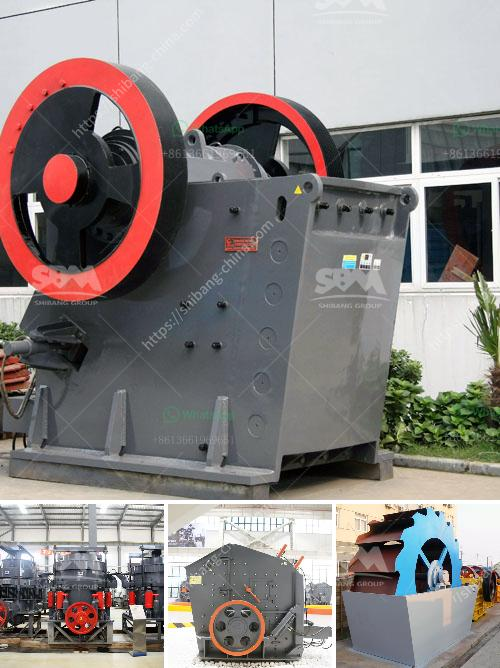

<h3>vertical ball mill nigeria</h3>
Vertical ball mill is a mill suitable for low efficient operation and the utilization of recycled waste materials. Vertical ball mill is equipped with a stirring device composed of vertical cylinder body (moving axis) and under medium (blower fan). Material is fed from the cylinder inlet and grinded by the impact and friction of steel balls and ore particles. Due to the continuous feeding of materials, ore particles with different sizes are continuously classified by the sieve bodies. The ground powder is discharged through the exhaust pipe, and the crushing process is continuous. 

Vertical ball mill has the shortcomings of traditional ball mill, such as low efficiency, high energy consumption, and inconvenient maintenance. Vertical ball mill mainly includes the main cylinder, feeding and discharging device, transmission device, grinding medium, and motor. It has the advantages of simple structure, easy operation and maintenance, stable performance, and high efficiency.

Vertical ball mill can be used for grinding various materials, such as calcium carbonate, marble, limestone, barite, talc, gypsum, quartz, silica, iron ore, copper ore, gold ore, bauxite, calcite, slag, etc. Especially for the production of micronized calcium carbonate, the vertical ball mill is the ideal selection. It can process calcium carbonate into fine powder less than 10 microns.

Vertical ball mill is composed of cylindrical cylinder, main bearing, transmission device, rotating device, feeding and discharging device, cylinder body, loading device and other components. The main components are composed of cylinder body, rolling bearing, pinion gear, deceleration device, roller coupling, motor and so on. The cylinder body is made of high-strength wear-resistant material, and the lining plate is made of high-strength wear-resistant material. The grinding medium is steel ball, steel rod, gravel or ore block, etc. Under the action of centrifugal force and grinding force, the grinding medium is lifted to a certain height and falls in a parabolic state, which generates impact, friction and grinding effect on the material to be ground.

Vertical ball mill has the characteristics of high grinding efficiency, low energy consumption, low noise, large drying capacity, product fineness easy to adjust, easy no dust pollution and maintenance, reliable operation. Especially in large-scale grinding technology, vertical ball mill occupies a very important position. In recent years, some foreign countries have developed several vertical ball mill models to adapt to various industries, such as cement, new building materials, non-metallic mining, etc., and have achieved good economic benefits.

In summary, vertical ball mill has the advantages of simple structure, easy operation and maintenance, stable performance, high efficiency and good energy saving effect. It is one of the ideal equipment for producing ultrafine powder. With the continuous development of technology and the improvement of grinding technology, vertical ball mill will have broader application prospects in the future.
<h3>Contact us</h3><ul><li><strong>Whatsapp:&nbsp;<a href="https://wa.me/8613661969651">+8613661969651</a></strong></li><li><a href="https://swt.shibang-china.com/?git&amp;zhl&amp;vertical ball mill nigeria"><strong>Online Service(chat now)</strong></a></li></ul><h3>Related</h3><ul><li><a href='micro powder grinder mill.md'>micro powder grinder mill</a></li><li><a href='mobile crusher capacity 200 ton per hour.md'>mobile crusher capacity 200 ton per hour</a></li><li><a href='indonesia ball mill.md'>indonesia ball mill</a></li><li><a href='types of diaphragm in ball mill.md'>types of diaphragm in ball mill</a></li><li><a href='demand of stage concassage mobile.md'>demand of stage concassage mobile</a></li></ul>