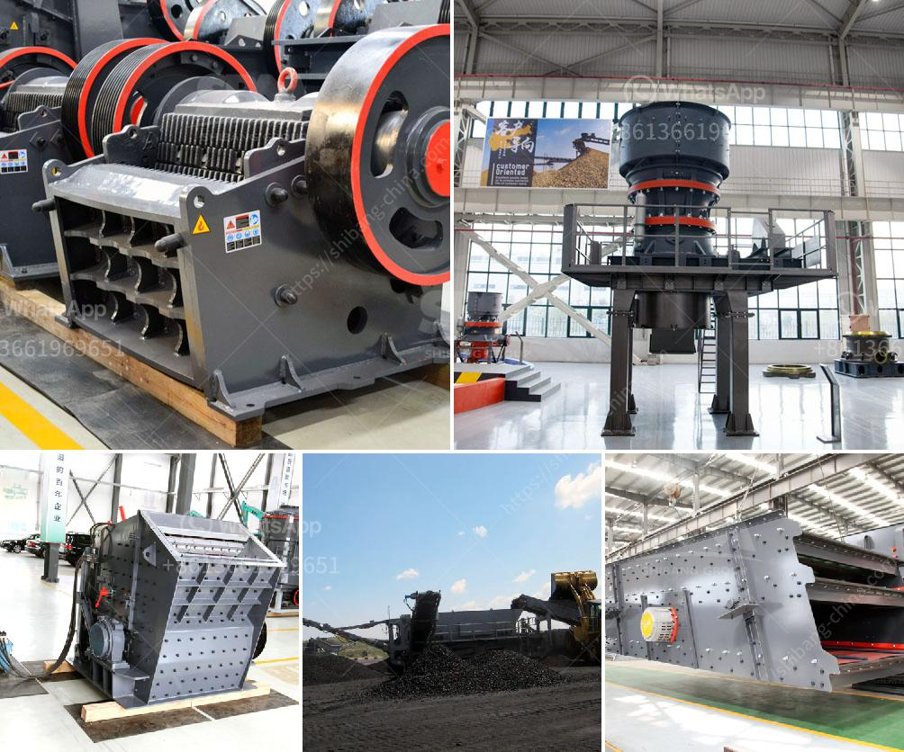

<h3>vertical conveyor for gravel transporting</h3>
Vertical conveyors have revolutionized the way gravel is transported in various industries. These ingenious machines efficiently and safely move gravel from lower to higher levels, eliminating the need for manual labor and maximizing productivity. With their ability to transport heavy loads, vertical conveyors offer a cost-effective and time-saving solution.

One of the main advantages of vertical conveyors for gravel transport is their space-saving design. Traditional methods of transporting gravel, such as forklifts or cranes, often require a large footprint and can be time-consuming. In contrast, vertical conveyors can be installed in tight spaces, allowing businesses to make the most of their available area. This is particularly beneficial in cramped construction sites or industrial facilities where every square meter counts.

Safety is another crucial aspect of vertical conveyors. Handling heavy and cumbersome materials like gravel can pose numerous risks to workers, including back injuries and strains. Vertical conveyors mitigate these risks by autonomously carrying the gravel to higher levels, eliminating the need for manual handling. Furthermore, modern vertical conveyors are equipped with safety features like emergency stop buttons and robust railings, ensuring the well-being of operators and preventing accidents.

The efficiency of vertical conveyors significantly boosts productivity in gravel transportation. These machines are equipped with powerful motors and durable belts, enabling them to transport large quantities of gravel within short periods. This results in faster project completion times and a higher output for businesses. Additionally, with the ability to transport gravel to varying heights, vertical conveyors simplify the logistics process, ensuring a smooth flow of materials and minimizing downtime.

In conclusion, vertical conveyors have proven to be an indispensable tool for gravel transportation. Their space-saving design, enhanced safety features, and efficiency make them the preferred choice for many industries. By improving productivity and eliminating manual labor, vertical conveyors have streamlined operations, saved time, and reduced costs. With the continued advancements in technology, these impressive machines will continue to play a vital role in the gravel transport industry.
<h3>Contact us</h3><ul><li><strong>Whatsapp:&nbsp;<a href="https://wa.me/8613661969651">+8613661969651</a></strong></li><li><a href="https://swt.shibang-china.com/?git&amp;zhl&amp;vertical conveyor for gravel transporting"><strong>Online Service(chat now)</strong></a></li></ul><h3>Related</h3><ul><li><a href='the cost of chrome washing plants in south africa.md'>the cost of chrome washing plants in south africa</a></li><li><a href='conveyor belt manufacturers in africa.md'>conveyor belt manufacturers in africa</a></li><li><a href='china cone crusher.md'>china cone crusher</a></li><li><a href='small mobile gold grinding mill in philippines.md'>small mobile gold grinding mill in philippines</a></li><li><a href='buy new bal mill.md'>buy new bal mill</a></li></ul>