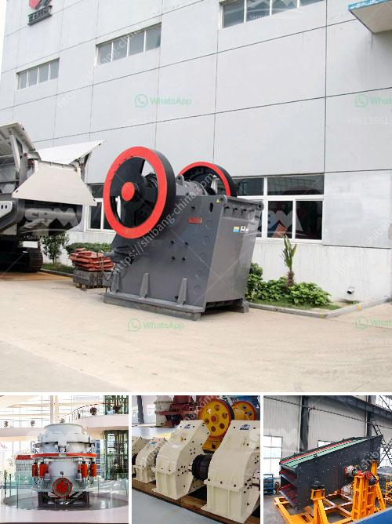

<h3>vertical grinding machine</h3>
A vertical grinding machine is a type of surface grinding machine that is used for giving a smooth finish to components and parts in major industrial sectors. Known for their precision and accuracy in shaping high-quality surfaces, they are commonly used in the automotive, aerospace, and engineering industries.

One of the major advantages of a vertical grinding machine is its ability to perform multiple grinding operations in a single setup. This means that complex components with different features can be machined efficiently and effectively, contributing to significant time and cost savings. Moreover, the vertical arrangement of the grinding wheel and table offers enhanced accessibility and better visibility during the grinding process, allowing for improved control and precision.

The vertical grinding machines come in various configurations, such as a single spindle, a dual-spindle, or even a multi-spindle setup. The choice of the specific machine depends on the nature of the workpiece and the desired grinding results. Additionally, these machines are equipped with advanced features such as automated tool changers, coolant systems, and in-process gauging systems, further enhancing their efficiency and productivity.

The applications of vertical grinding machines are diverse and extensive. One of the primary applications is in the automotive industry, where these machines are used for grinding engine components, camshafts, crankshafts, and transmission parts. In the aerospace industry, they are utilized to grind turbine blades, rotor shafts, and landing gear components. In the engineering sector, vertical grinding machines are employed for machining precision dies, molds, and various intricate parts.

Exact surface finishes and tight tolerances are crucial when it comes to the manufacturing of high-quality components, and vertical grinding machines excel in achieving these requirements. They are capable of grinding both hard and soft materials, including ferrous and non-ferrous metals, composites, and ceramics, making them versatile and adaptable to a wide range of applications.

Furthermore, vertical grinding machines are preferred for their minimal footprint and compact design. This makes them suitable for installation in limited workspace areas, allowing for optimal utilization of the available floor space. Additionally, the vertical arrangement of the machine also aids in reducing vibrations, resulting in improved surface finishes and longer tool life.

In conclusion, vertical grinding machines offer numerous advantages over traditional surface grinding machines. Their ability to perform multiple grinding operations in a single setup, the ease of accessibility, and the precision they provide make them an essential tool in various industrial sectors. From automotive to aerospace and engineering, the applications of vertical grinding machines are extensive, ensuring the production of high-quality, accurate components. With their compact design, minimal footprint, and compatibility with a wide range of materials, these machines are a reliable choice for achieving precise surface finishes and superior quality results.
<h3>Contact us</h3><ul><li><strong>Whatsapp:&nbsp;<a href="https://wa.me/8613661969651">+8613661969651</a></strong></li><li><a href="https://swt.shibang-china.com/?git&amp;zhl&amp;vertical grinding machine"><strong>Online Service(chat now)</strong></a></li></ul><h3>Related</h3><ul><li><a href='dolomite roller mill.md'>dolomite roller mill</a></li><li><a href='ball mills for 10 tons of ore.md'>ball mills for 10 tons of ore</a></li><li><a href='concrete crusher made in japan.md'>concrete crusher made in japan</a></li><li><a href='large scale gold mining equipment for sale.md'>large scale gold mining equipment for sale</a></li><li><a href='hammer mill of 1 ton per hour.md'>hammer mill of 1 ton per hour</a></li></ul>