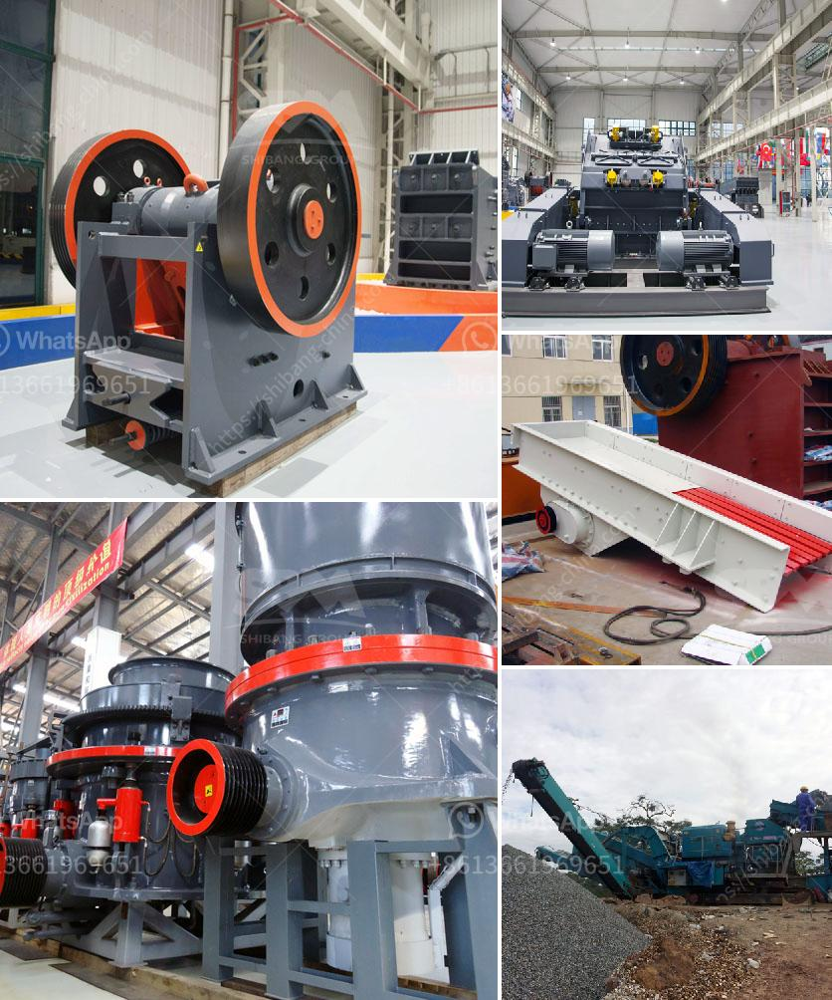

<h3>vertical horizontal ball milling machine</h3>
The vertical horizontal ball milling machine is a versatile tool that combines both vertical and horizontal capabilities in one machine. It is a cost-effective solution for both small and large scale industries as it can perform many tasks with excellent precision.

One of the key advantages of this machine is its ability to perform both vertical and horizontal milling operations. Vertical milling refers to the process of removing material from a workpiece using a rotating cutter with multiple cutting edges. This is ideal for creating deep slots, pockets, and other complex features. Horizontal milling, on the other hand, involves removing material from the workpiece using a rotating cutter with single cutting edge. This is perfect for creating flat surfaces, shoulders, and slots.

By combining these two capabilities, the vertical horizontal ball milling machine becomes incredibly versatile. It can handle a wide range of milling tasks, from simple to complex, in a single setup. This eliminates the need for multiple machines, reducing production time and costs. Moreover, it allows operators to work on different sides of a workpiece without the need for repositioning, enhancing efficiency and productivity.

This machine utilizes a ball mill, a cylindrical container filled with steel balls, which grind materials by impacting and grinding them as the mill rotates. The balls can range in size from small ones for fine grinding, to larger ones for coarser grinding. This generates high energy collision between the balls and the material, resulting in finely ground particles.

In addition to its versatility, the vertical horizontal ball milling machine offers excellent precision and accuracy. It is equipped with advanced controls and a high-precision spindle, ensuring consistent and accurate machining. This is crucial for industries that require tight tolerances and smooth finishes, such as aerospace, automotive, and medical industries.

Another advantage of this machine is its compact design, which saves valuable floor space. It can fit into small workshops and production areas, making it suitable for various industrial settings. Despite its compact size, it does not compromise on performance and can handle heavy-duty machining tasks.

Maintenance and operation of the vertical horizontal ball milling machine are relatively simple. Regular cleaning, lubrication, and inspection of the machine components help maintain its performance and extend its lifespan. Operators should also follow proper safety protocols to ensure a safe working environment.

In conclusion, the vertical horizontal ball milling machine is a versatile and cost-effective solution for various machining tasks. Its ability to perform both vertical and horizontal milling operations, coupled with its precision and compact design, make it an ideal choice for industries of all sizes. With its advanced controls and high-precision spindle, it can consistently deliver high-quality results. Whether it's creating complex features or achieving tight tolerances, this machine can handle it all.
<h3>Contact us</h3><ul><li><strong>Whatsapp:&nbsp;<a href="https://wa.me/8613661969651">+8613661969651</a></strong></li><li><a href="https://swt.shibang-china.com/?git&amp;zhl&amp;vertical horizontal ball milling machine"><strong>Online Service(chat now)</strong></a></li></ul><h3>Related</h3><ul><li><a href='howhow to set up a stone crushing business.md'>howhow to set up a stone crushing business</a></li><li><a href='24 x 15 jaw crusher zenith.md'>24 x 15 jaw crusher zenith</a></li><li><a href='turkey of gold refinery project cost.md'>turkey of gold refinery project cost</a></li><li><a href='ballast crushing equipment in kenya.md'>ballast crushing equipment in kenya</a></li><li><a href='jaw crushers 100tph.md'>jaw crushers 100tph</a></li></ul>