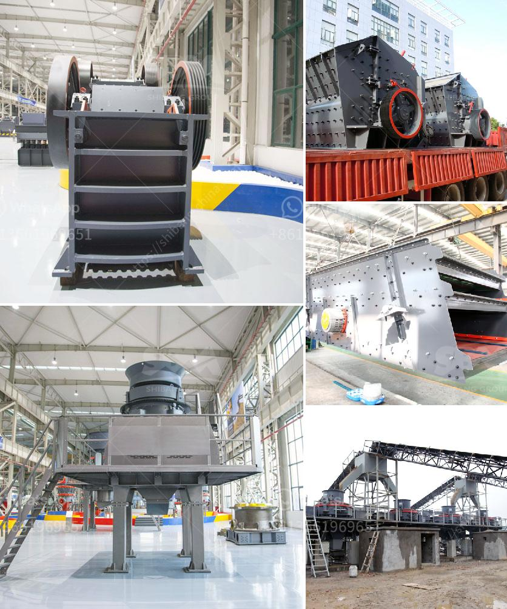

<h3>vertical mill ball compsition</h3>
A vertical mill ball is a type of grinding equipment used to grind materials into extremely fine powder for use in mineral dressing processes, paints, pyrotechnics, and ceramics. The composition of the vertical mill ball plays a crucial role in its performance and efficiency.

The primary components of a vertical mill ball are the grinding media, which include grinding balls and beadings, and the materials to be ground. The grinding media are usually made of high-chromium steel or manganese steel. These materials have high hardness and excellent wear resistance, ensuring the longevity and durability of the vertical mill ball.

The size and proportion of the grinding media in the vertical mill ball are critical factors in achieving the desired grinding effect. The larger the size of the grinding media, the higher the impact force, resulting in faster and more efficient grinding. However, an excessive amount of large grinding media can lead to over-grinding and unnecessary energy consumption.

The composition of the materials being ground also influences the selection of grinding media. For example, when grinding materials with high hardness, such as ores or cement clinker, grinding balls with high hardness and wear resistance are preferred. On the other hand, for softer materials like paints or pigments, smaller grinding media like beadings are more suitable.

In addition to the grinding media, other components of the vertical mill ball include the mill body, the grinding chamber, and the motor. These components work together to ensure smooth operation, efficient grinding, and accurate particle size distribution.

In conclusion, the composition of a vertical mill ball is crucial in determining its performance and efficiency. The selection of appropriate grinding media, considering factors such as hardness and wear resistance, is essential for achieving the desired grinding effect. With the right composition, a vertical mill ball can provide efficient grinding and produce high-quality powdered materials for various industries.
<h3>Contact us</h3><ul><li><strong>Whatsapp:&nbsp;<a href="https://wa.me/8613661969651">+8613661969651</a></strong></li><li><a href="https://swt.shibang-china.com/?git&amp;zhl&amp;vertical mill ball compsition"><strong>Online Service(chat now)</strong></a></li></ul><h3>Related</h3><ul><li><a href='stone crushing machine manufacturer.md'>stone crushing machine manufacturer</a></li><li><a href='vsi crusher machine.md'>vsi crusher machine</a></li><li><a href='grinding mill for quartz in india.md'>grinding mill for quartz in india</a></li><li><a href='difference between vsi and sand making machine.md'>difference between vsi and sand making machine</a></li><li><a href='coal charcoal crushing grinding machine small.md'>coal charcoal crushing grinding machine small</a></li></ul>