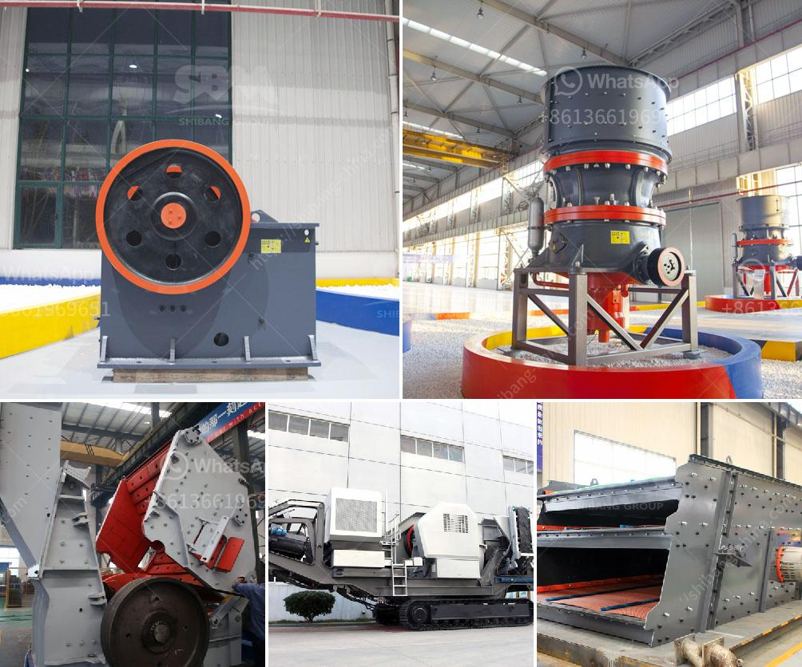

<h3>vertical mill china</h3>
China, in recent years, has emerged as a global leader in various sectors, including manufacturing and industrial machinery. One such advanced technology that has gained significant momentum in China is the vertical mill. Known for its efficiency and precision, the vertical mill has become the focal point of industrial machinery in China.

A vertical mill, also known as a vertical roller mill, is used in the field of mineral processing and coal production. It mainly consists of a motor, a transmission device, a separator, a roller device, a grinding disc device, and a pressure device. With advanced grinding technology, the vertical mill excels at grinding materials into extremely fine powders.

The rise of the vertical mill in China can be attributed to several factors. Firstly, China has abundant mineral resources, and the vertical mill proves to be the ideal machinery for extracting and processing these resources efficiently. Whether it is processing limestone, gypsum, coal, or any other raw material, the vertical mill guarantees high performance and productivity.

Secondly, the vertical mill is eco-friendly. With the growing concerns over environmental pollution, China has been proactive in adopting sustainable practices in its industries. The vertical mill minimizes dust and noise pollution, making it a reliable and environmentally-friendly choice for industrial applications.

Moreover, the vertical mill offers unparalleled versatility. It can handle a wide range of materials, from soft to hard, and from wet to dry. This adaptability ensures that the vertical mill can be utilized across various industries, such as cement, power generation, metallurgy, chemical, and even waste disposal.

The superiority of the vertical mill has not gone unnoticed by Chinese manufacturers. Several leading machinery manufacturers in China have invested heavily in developing and refining vertical mill technology. As a result, Chinese-made vertical mills are now highly regarded globally for their quality and performance.

In addition, the competitive pricing of vertical mills from China has contributed to their popularity both at home and abroad. Chinese manufacturers provide cost-effective solutions to industries worldwide, making the vertical mill an attractive choice for businesses looking to optimize their production processes.

Furthermore, the vertical mill is equipped with advanced control systems, ensuring high precision and stability during operation. This level of automation greatly reduces the risk of human error and improves overall efficiency. The digitalization of the vertical mill has made it easier for operators to monitor and adjust parameters, leading to increased productivity and reduced downtime.

China's commitment to innovation and technological advancements has been instrumental in the development of the vertical mill. By embracing cutting-edge technologies and leveraging its manufacturing prowess, China has established itself as a global leader in industrial machinery. The vertical mill serves as a prime example of China's ability to create highly efficient and reliable machinery that caters to the diverse needs of industries worldwide.

In conclusion, the vertical mill has revolutionized the industrial machinery sector in China. Its exceptional performance, eco-friendliness, versatility, and cost-effectiveness make it an ideal choice for various industries. With the continuous advancements in vertical mill technology, China is poised to maintain its leading position in the global market, contributing to the growth and development of industries worldwide.
<h3>Contact us</h3><ul><li><strong>Whatsapp:&nbsp;<a href="https://wa.me/8613661969651">+8613661969651</a></strong></li><li><a href="https://swt.shibang-china.com/?git&amp;zhl&amp;vertical mill china"><strong>Online Service(chat now)</strong></a></li></ul><h3>Related</h3><ul><li><a href='raymond mill manufacturer in india.md'>raymond mill manufacturer in india</a></li><li><a href='silica sand quarry for sale in tunisia in cork ireland.md'>silica sand quarry for sale in tunisia in cork ireland</a></li><li><a href='granite milling unit.md'>granite milling unit</a></li><li><a href='crush molybdenum equipment.md'>crush molybdenum equipment</a></li><li><a href='coal pulverizer types.md'>coal pulverizer types</a></li></ul>