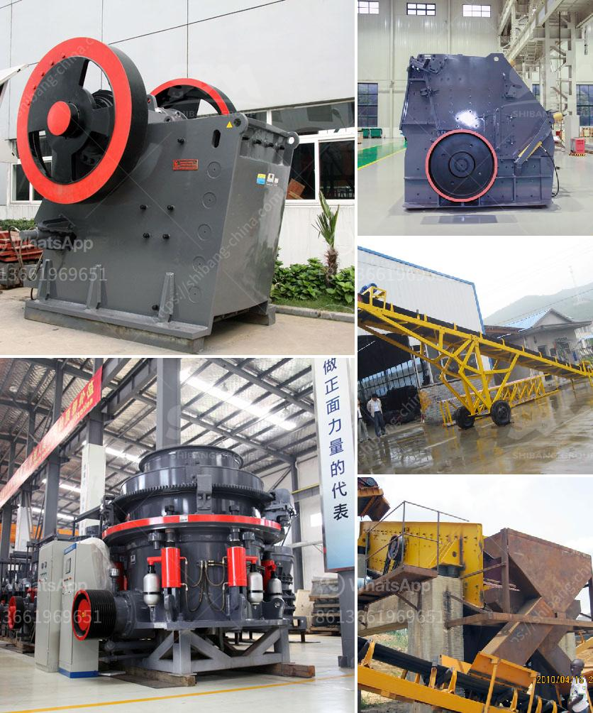

<h3>vertical mill machine in cement industry</h3>
Vertical mill machine, also known as vertical roller mill, is an essential equipment in the cement manufacturing industry. It is a highly efficient machine that is used for grinding raw materials into finished cement clinker. Vertical mill is widely used in cement industry, and its role in cement production cannot be underestimated.

The cement manufacturing process involves the fine grinding of raw materials, such as limestone, clay, sand, and iron ore. Vertical mill machine aids in the grinding process by providing a consistent and uniform grinding surface, resulting in improved efficiency and higher quality cement. This machine is capable of grinding materials to a very fine powder, which is essential for the production of cement clinker.

One of the key advantages of vertical mill machine is its energy efficiency. Compared to traditional ball mills, which can consume a significant amount of energy, vertical mill machine utilizes less energy to grind materials. This not only reduces energy consumption but also lowers operating costs, making it a favorable choice for cement manufacturers.

Another advantage of vertical mill machine is its versatility. It can be used for grinding different types of materials, including cement clinker, slag, coal, and minerals. This flexibility allows cement manufacturers to adapt to changing market demands and produce various types of cement to meet customer requirements.

Vertical mill machine also offers a compact design, which saves space in the cement plant. Its vertical structure allows for a smaller footprint, enabling manufacturers to optimize their production layout and utilize the available space more efficiently.

In conclusion, vertical mill machine plays a crucial role in the cement industry. With its energy efficiency, versatility, and compact design, it helps cement manufacturers produce high-quality cement at a lower cost. As the cement industry continues to evolve, vertical mill machine is expected to remain an important equipment for cement production.
<h3>Contact us</h3><ul><li><strong>Whatsapp:&nbsp;<a href="https://wa.me/8613661969651">+8613661969651</a></strong></li><li><a href="https://swt.shibang-china.com/?git&amp;zhl&amp;vertical mill machine in cement industry"><strong>Online Service(chat now)</strong></a></li></ul><h3>Related</h3><ul><li><a href='portable crushing machine from spain.md'>portable crushing machine from spain</a></li><li><a href='artificial sand machine.md'>artificial sand machine</a></li><li><a href='china granite jaw crusher.md'>china granite jaw crusher</a></li><li><a href='cost of complete stone crushing plant in ghana.md'>cost of complete stone crushing plant in ghana</a></li><li><a href='coal pulverisers machines.md'>coal pulverisers machines</a></li></ul>