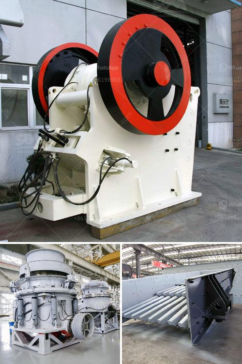

<h3>vertical mill size</h3>
The size of a vertical mill plays a crucial role in determining its efficiency and capabilities. Vertical milling machines are known for their versatility and ability to handle a wide range of materials, from soft plastics to hard metals. Choosing the right size of a vertical mill is essential for achieving desired results, as it affects the machine's stability, rigidity, and power.

One aspect to consider when determining the size of a vertical mill is the workpiece size. Larger workpieces require a bigger machine with a larger working envelope to accommodate their dimensions. A small mill may not have enough table space to handle larger projects, limiting the size of workpieces that can be processed.

Alongside workpiece size, the size of a vertical mill also affects its rigidity and stability. Large milling machines are generally more stable due to their heavier weight and sturdier construction. This enhanced stability allows for higher cutting forces and enables the milling of tougher materials with improved precision. Smaller mills, while more compact and potentially cost-effective, may lack the stability needed to achieve high levels of accuracy, especially when dealing with heavy-duty materials.

The size of a vertical mill also influences its power and cutting capabilities. Larger mills are commonly equipped with more powerful spindles, motors, and tooling systems. These features enable them to generate higher cutting speeds and handle more demanding machining tasks. Smaller mills, on the other hand, may be suitable for lighter machining operations that require less power.

In conclusion, the size of a vertical mill is a crucial factor to consider when choosing the right machine for a specific application. Workpiece size, stability, rigidity, and power should all be taken into account to ensure optimal performance. It is important to assess the anticipated requirements and select a mill that can accommodate the desired workload efficiently and effectively.
<h3>Contact us</h3><ul><li><strong>Whatsapp:&nbsp;<a href="https://wa.me/8613661969651">+8613661969651</a></strong></li><li><a href="https://swt.shibang-china.com/?git&amp;zhl&amp;vertical mill size"><strong>Online Service(chat now)</strong></a></li></ul><h3>Related</h3><ul><li><a href='quarry rock crusher.md'>quarry rock crusher</a></li><li><a href='gypsum recycling plant.md'>gypsum recycling plant</a></li><li><a href='sand sieve machine philippines.md'>sand sieve machine philippines</a></li><li><a href='antimony processing plant design.md'>antimony processing plant design</a></li><li><a href='cement clinker plant machinery hyderabad.md'>cement clinker plant machinery hyderabad</a></li></ul>