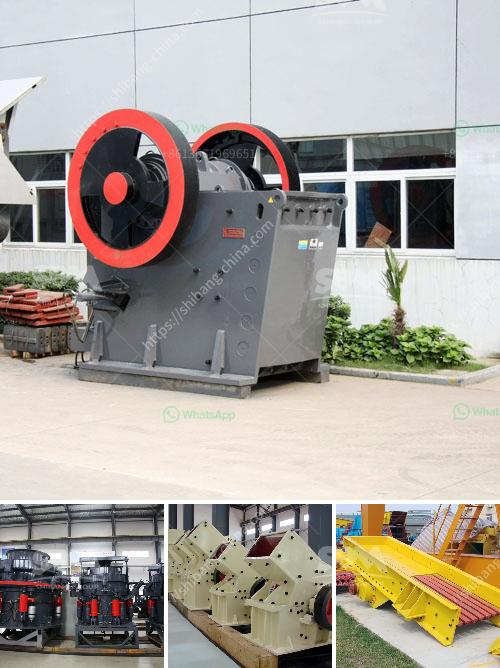

<h3>vertical mills nigeria ball mill catalog</h3>
Vertical mills, also known as vertical roller mills, have gained significant popularity in the manufacturing industry in Nigeria. These mills utilize a rotating grinding table to crush and grind various materials, resulting in finer and more uniform particle sizes compared to traditional ball mills. In this article, we will explore the numerous advantages of vertical mills and their application in Nigeria's manufacturing industry.

1. Higher Efficiency: Vertical mills are known for their greater efficiency compared to ball mills. This is achieved through their ability to handle high fineness and high production rates. The vertical grinding principle ensures that the grinding rollers are continuously in contact with the material, resulting in more effective grinding.

2. Lower Energy Consumption: Vertical mills use less energy compared to ball mills for grinding similar materials, making them a more economical choice. This reduction in energy consumption not only helps reduce operational costs but also minimizes the environmental impact.

3. Flexibility in Material Processing: Vertical mills can process a wide range of materials, including limestone, coal, phosphate, clay, and more. This versatility makes them suitable for various industrial applications, such as cement production, mining, and mineral processing.

4. Enhanced Product Quality: The design of vertical mills ensures a consistent and homogeneous grinding process, leading to superior product quality. The vertical arrangement of the grinding elements helps in achieving precise control over the grinding parameters, resulting in finer particle sizes and improved cement or material properties.

1. Cement Production: Vertical mills have revolutionized cement production in Nigeria. The ability to grind different types of raw materials with varying moisture levels and particle sizes has significantly improved cement quality and production rates. Furthermore, vertical mills enable the utilization of blast furnace slag and fly ash as cement additives, contributing to sustainable cement manufacturing.

2. Mineral Processing: Nigeria is rich in various mineral resources, including gold, coal, and limestone. Vertical mills are extensively used in the mineral processing industry for grinding and pulverizing these minerals to extract valuable metals or produce mineral powders used in various industrial applications.

3. Power Generation: The Nigerian power generation industry relies heavily on coal-fired power plants. Vertical mills are utilized to grind coal into fine particles, which are then used as fuel in the power plants. The high efficiency and low energy consumption of vertical mills make them ideal for this application, enabling efficient and reliable power generation.

Vertical mills have emerged as a preferred choice in Nigeria's manufacturing industry due to their numerous advantages such as higher efficiency, lower energy consumption, and enhanced product quality. Their applications range from cement production to mineral processing and power generation. As Nigeria's manufacturing sector continues to grow, vertical mills will continue to play a crucial role in improving productivity, reducing costs, and promoting sustainability in various industrial processes.
<h3>Contact us</h3><ul><li><strong>Whatsapp:&nbsp;<a href="https://wa.me/8613661969651">+8613661969651</a></strong></li><li><a href="https://swt.shibang-china.com/?git&amp;zhl&amp;vertical mills nigeria ball mill catalog"><strong>Online Service(chat now)</strong></a></li></ul><h3>Related</h3><ul><li><a href='calcite quarry crusher sri lanka.md'>calcite quarry crusher sri lanka</a></li><li><a href='ball mills for 10 tons of ore.md'>ball mills for 10 tons of ore</a></li><li><a href='mobile dimension stone processing.md'>mobile dimension stone processing</a></li><li><a href='hammer mill capacity.md'>hammer mill capacity</a></li><li><a href='china raymond roller mills.md'>china raymond roller mills</a></li></ul>