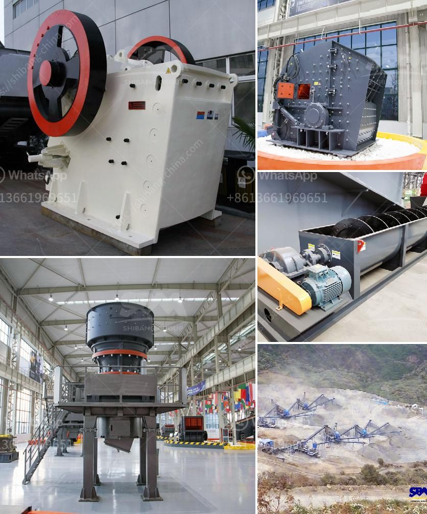

<h3>vertical shaft impact crusher for sale</h3>
Vertical shaft impact crusher, commonly known as VSI crusher, is popular for its unique ability to turn aggregate materials into finished products of cubic shape. Unlike compression crushers such as jaw crushers or cone crushers, vertical shaft impact crushers work by hurling materials against the walls of the crusher to shatter them into smaller particles.

The vertical shaft impact crusher industry has been growing steadily due to the immense advantages it offers over conventional crushers. Some of the key benefits of vertical shaft impact crushers include their ability to handle a wide range of materials and finishes, low maintenance requirements, and high reduction ratios.

One of the primary advantages of vertical shaft impact crushers is their versatility. These crushers can handle a variety of materials, including hard rocks, minerals, construction debris, concrete, and asphalt. This versatile nature makes them ideal for use in various industries such as mining, construction, and recycling.

Another significant advantage of vertical shaft impact crushers is their low maintenance requirements. These crushers use a rotor that evenly distributes the force to break the particles, reducing wear and tear on the crusher. Additionally, they have fewer moving parts compared to other crushers, resulting in less maintenance and lower operating costs.

Vertical shaft impact crushers are also known for their high reduction ratios, meaning they can efficiently produce smaller particle sizes. This reduction in size is achieved by the rapid acceleration of particles through the rotor, resulting in high-speed impacts against the crushing chamber walls. As a result, these crushers can produce finished products of cubic shape, which are highly sought after in the construction industry.

When considering the purchase of a vertical shaft impact crusher, it is essential to choose a reliable and reputable manufacturer. The quality and durability of the crusher will play a vital role in its performance and longevity. Furthermore, considering factors such as the production capacity, feed size, and power requirements are crucial to ensure the crusher meets your specific needs.

While there are numerous manufacturers offering vertical shaft impact crushers for sale, it is recommended to work with a manufacturer that has a proven track record and provides excellent after-sales support. Before making a purchase, it is advisable to consult with the manufacturer or supplier to discuss your requirements in detail. This will ensure that you find the most appropriate crusher model for your application.

In conclusion, vertical shaft impact crushers offer a range of benefits that make them a preferable choice for many industries. Their versatility, low maintenance requirements, and ability to produce high-quality finished products make them an attractive option. By working with a reputable manufacturer and carefully considering your specific requirements, you can find a vertical shaft impact crusher that meets your needs and contributes to your operational success.
<h3>Contact us</h3><ul><li><strong>Whatsapp:&nbsp;<a href="https://wa.me/8613661969651">+8613661969651</a></strong></li><li><a href="https://swt.shibang-china.com/?git&amp;zhl&amp;vertical shaft impact crusher for sale"><strong>Online Service(chat now)</strong></a></li></ul><h3>Related</h3><ul><li><a href='dolomite powder making.md'>dolomite powder making</a></li><li><a href='techniques chips of metal conveyor belts.md'>techniques chips of metal conveyor belts</a></li><li><a href='mobile crusher di malaysia.md'>mobile crusher di malaysia</a></li><li><a href='advantages of reversible impact hammer crusher.md'>advantages of reversible impact hammer crusher</a></li><li><a href='indonesia ball mills in peru.md'>indonesia ball mills in peru</a></li></ul>