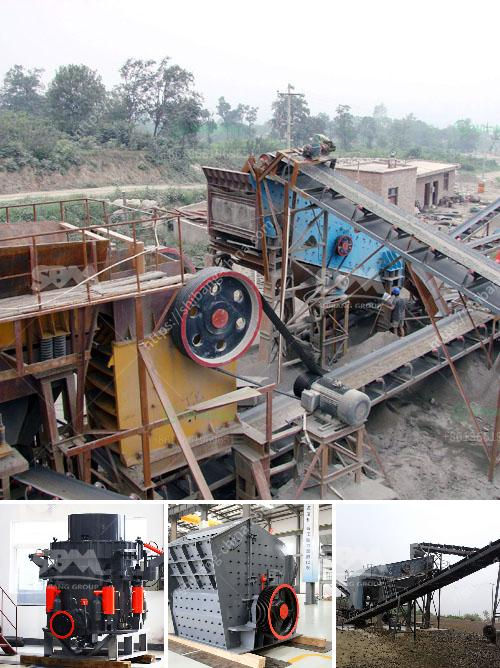

<h3>vertical shaft impact crusher from new zealand</h3>
The demand for construction materials in New Zealand is consistently on the rise, which has led to an increase in the production of aggregates such as concrete, asphalt, and road base. To meet this growing demand, companies in the construction industry are investing in advanced equipment, including vertical shaft impact crushers.

Vertical shaft impact (VSI) crushers are designed to be used in secondary, tertiary or quaternary stage crushing. The crushers are suitable for a wide range of applications, including the production of high-quality manufactured sand, well-formed aggregates, and industrial minerals. In New Zealand, the crushers are commonly used at construction sites and in the quarrying industry.

One of the key advantages of a vertical shaft impact crusher is its ability to create excellent particle shape. This is due to the crusher’s unique rock-on-rock crushing action. Unlike other types of crushers that use metal parts to break down rocks, VSI crushers rely on the high-speed impact and attrition between rocks to produce a consistent, cubical product.

In addition to the particle shape, VSI crushers also provide a cost-effective solution for reducing the size of hard and abrasive materials. By crushing the rocks in the vertical chamber, the crushers consume less energy compared to conventional cone crushers. This results in lower operating costs and reduced carbon emissions, making them environmentally friendly.

Furthermore, VSI crushers offer flexibility in terms of adjusting the rotor speed and cascade ratio, allowing operators to fine-tune the production of different end products. This versatility makes them ideal for a wide range of applications, whether it's producing sand for concrete, asphalt, or road base.

New Zealand has embraced the use of vertical shaft impact crushers, with several major construction companies using them for various projects. For example, one company in Hamilton has been utilizing a vertical shaft impact crusher in its quarry to produce high-quality aggregates for the construction of bridges, roadways, and buildings.

The company reported a significant improvement in the overall quality of the final product compared to traditional crushers. The cubicity and particle shape achieved through the VSI crusher have resulted in increased demand from customers, ultimately leading to higher profits for the company.

In conclusion, vertical shaft impact crushers have proven to be a valuable asset in the construction industry in New Zealand. These crushers provide a superior particle shape, reduce operating costs, and offer flexibility in producing different end products. With the increasing demand for construction materials in the country, the use of VSI crushers is expected to continue to grow, leading to improved efficiency and productivity in the construction sector.
<h3>Contact us</h3><ul><li><strong>Whatsapp:&nbsp;<a href="https://wa.me/8613661969651">+8613661969651</a></strong></li><li><a href="https://swt.shibang-china.com/?git&amp;zhl&amp;vertical shaft impact crusher from new zealand"><strong>Online Service(chat now)</strong></a></li></ul><h3>Related</h3><ul><li><a href='fly ash processing plant.md'>fly ash processing plant</a></li><li><a href='hammer mill of 1 ton per hour.md'>hammer mill of 1 ton per hour</a></li><li><a href='ball mills for 10 tons of ore.md'>ball mills for 10 tons of ore</a></li><li><a href='ultra fine grinding mill price.md'>ultra fine grinding mill price</a></li><li><a href='enquiry crushing machine.md'>enquiry crushing machine</a></li></ul>