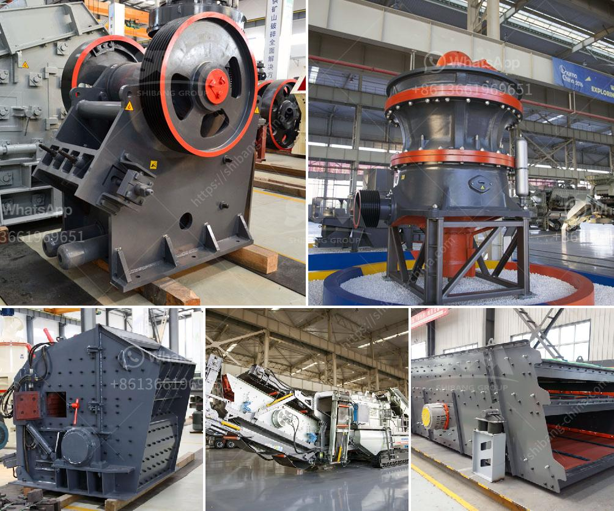

<h3>vertical vertical raw mill</h3>
Vertical raw mill is a type of industrial equipment used to crush or grind materials into small particles. Vertical raw mills are widely used in the concrete and mining fields, and are also used to process gypsum. These units can process both raw and recycled materials, while helping to reduce waste and preserve virgin supplies of these materials.

Vertical raw mills have many advantages over traditional horizontal mills. One of the biggest advantages is their ability to process materials with higher moisture content. Traditional horizontal mills require a dryer to process raw materials with higher moisture content, which adds to the operational costs. Vertical raw mills, on the other hand, have integrated drying capabilities and can process materials with up to 25% moisture content without the need for additional equipment, resulting in cost savings.

Another advantage of vertical mills is their compact design, which takes up less space in the manufacturing facility. This allows for more efficient use of the available space and can lead to increased productivity. Additionally, the vertical design allows for easier maintenance and repair, as the components are easily accessible.

The grinding process in a vertical raw mill is performed by a hydraulic pressure system. The grinding roller is pressed on the material layer, and the grinding disc rotates to crush and grind the material. The final product is collected in a bag filter or cyclone separator and can be discharged through the exhaust gas pipeline system to reduce environmental pollution.

Vertical raw mills are commonly used in the cement industry to grind raw materials such as limestone, clay, shale, and iron ore into a fine powder called raw meal. This powder is then heated in a kiln to cement clinker, which is the end product of the cement manufacturing process. The clinker is further ground into cement in a ball mill, along with gypsum and other additives.

In the mining industry, vertical raw mills can also be used to crush or grind various ores and other materials. Some mining applications where vertical raw mills are used include gold, copper, lead, zinc, and coal grinding.

Vertical raw mills are considered as the mills of choice for raw materials grinding in the cement industry. Their advantages over ball mills include lower energy consumption, higher drying capacity, and the ability to grind materials with higher moisture content. They are widely used in the cement industry due to their ability to achieve the desired fineness of the raw materials.

In conclusion, vertical raw mills are essential equipment in the cement and mining industries. They offer several advantages such as higher moisture content processing, compact design, ease of maintenance, and environmental sustainability. With the increasing demand for cement and other raw materials, the vertical raw mill is expected to play a crucial role in the future of industrial grinding.
<h3>Contact us</h3><ul><li><strong>Whatsapp:&nbsp;<a href="https://wa.me/8613661969651">+8613661969651</a></strong></li><li><a href="https://swt.shibang-china.com/?git&amp;zhl&amp;vertical vertical raw mill"><strong>Online Service(chat now)</strong></a></li></ul><h3>Related</h3><ul><li><a href='how to mine limestone small scale.md'>how to mine limestone small scale</a></li><li><a href='salary of crusher operer in philippines.md'>salary of crusher operer in philippines</a></li><li><a href='used ball mill in gujrat.md'>used ball mill in gujrat</a></li><li><a href='dealers and manufacturers crusher in europe.md'>dealers and manufacturers crusher in europe</a></li><li><a href='stone crushing plant for sale in pakistan.md'>stone crushing plant for sale in pakistan</a></li></ul>