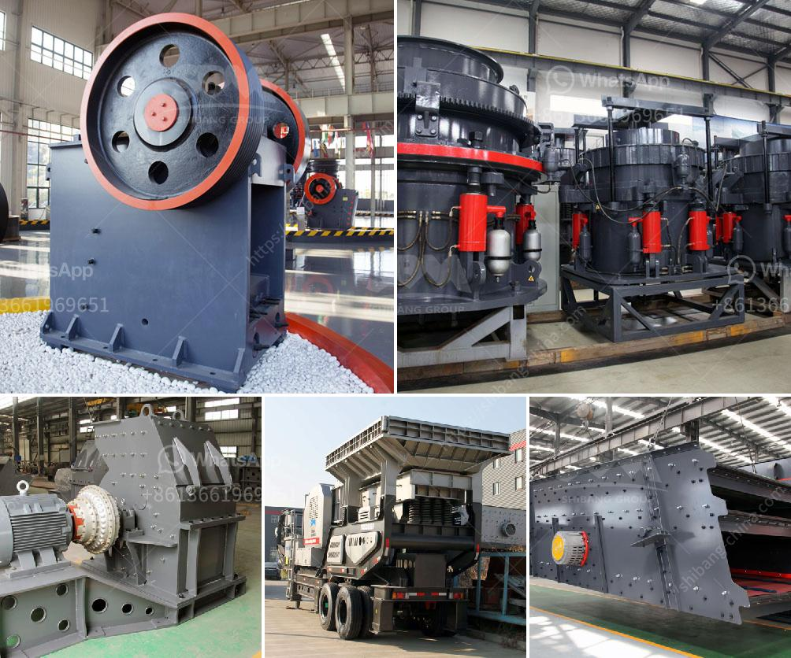

<h3>vertical vertical roller mill drives</h3>
Vertical roller mills (VRMs) have become the equipment of choice for raw and solid fuel grinding in cement factories. Increasingly modern cement plants also use VRMs for cement grinding. However, opportunities for the optimisation of VRMs are less obvious than with ball mills as all processes of grinding, drying, classification and regrinding take place within the body of the mill. Normal VRM control strategies have proven inadequate for such an environment, so the development of adaptive VRM control systems has become a necessity.

One of the key components of these adaptive control systems is the vertical roller mill drive, which is influenced by many internal and external factors. The drive plays a crucial role in influencing the performance and efficiency of the VRM.

In recent years, there has been a growing trend towards the use of vertical roller mills for grinding raw materials, which has led to an increase in the demand for efficient and reliable drive systems. The vertical roller mill drive is an integral part of the VRM, ensuring its smooth operation and high reliability.

Vertical roller mill drives are very reliable components, and the failure of these drives can cause serious production setbacks in cement plants. To achieve high reliability, precise operation, and long service life, it is important to monitor the operational parameters and react accordingly to prevent failure or damage to the drive system.

The development of sophisticated control systems for VRMs has led to the emergence of advanced drive technologies. These technologies provide enhanced control over the VRM drive system, leading to improved operational efficiency, reduced downtime, and increased production capacity. The advanced drive technologies allow for real-time monitoring of key parameters such as speed, torque, and power consumption, and enable proactive preventive maintenance.

The vertical roller mill drive systems have undergone significant advancements over the years. Today's VRM drives are compact and efficient, delivering reliable performance and high power density. Most notably, the use of advanced materials and lubrication techniques has contributed to increased efficiency and reduced maintenance requirements. The modern VRM drive systems are capable of handling a wide range of loads and are designed to operate in extreme conditions, ensuring the smooth operation of the VRM.

In conclusion, vertical roller mill drives play a crucial role in the smooth operation and performance of VRMs in cement plants. The use of advanced drive technologies and monitoring systems ensures that these drives operate efficiently, reliably, and with a long service life. As the demand for VRMs continues to grow, the development and improvement of vertical roller mill drives will remain crucial in meeting the industry's needs for efficiency and reliability.
<h3>Contact us</h3><ul><li><strong>Whatsapp:&nbsp;<a href="https://wa.me/8613661969651">+8613661969651</a></strong></li><li><a href="https://swt.shibang-china.com/?git&amp;zhl&amp;vertical vertical roller mill drives"><strong>Online Service(chat now)</strong></a></li></ul><h3>Related</h3><ul><li><a href='italia gypsum block making mechines.md'>italia gypsum block making mechines</a></li><li><a href='small sized cement plant project cost in india.md'>small sized cement plant project cost in india</a></li><li><a href='coal pulverizer price.md'>coal pulverizer price</a></li><li><a href='conveyor belts for sale philippines.md'>conveyor belts for sale philippines</a></li><li><a href='used 3 ft cone crusher.md'>used 3 ft cone crusher</a></li></ul>