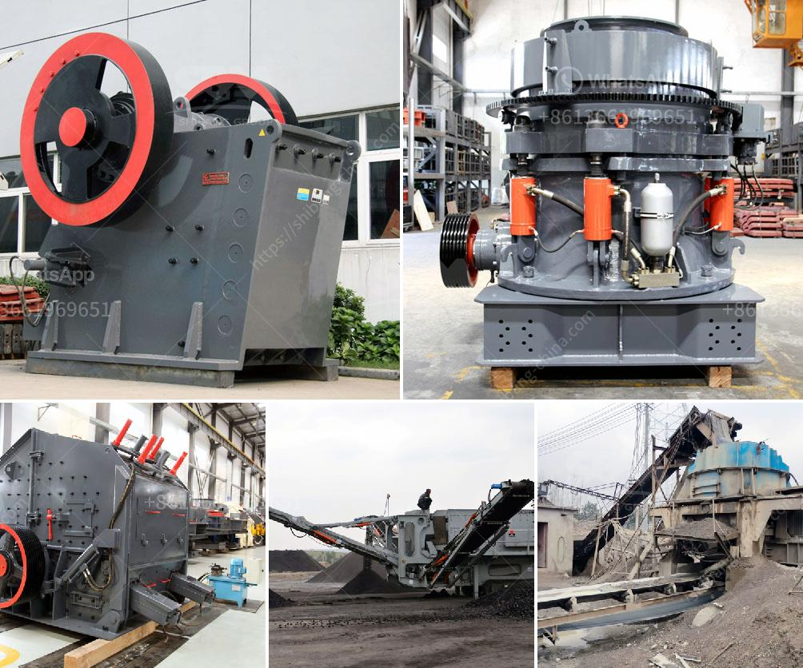

<h3>vibrating feeder suppliers in the philippines</h3>
Vibrating feeders are widely utilized in various industries in the Philippines, including mining, construction, and food processing. They serve as an essential component in the manufacturing sector, ensuring the smooth and efficient transportation of materials from one process to another. Consequently, the demand for vibrating feeder suppliers in the Philippines is also steadily increasing.

A vibrating feeder is a device that uses vibration to "feed" or convey materials, often in bulk, for processing and other industrial uses. These devices help move raw materials, semi-finished products, and final products efficiently along production lines. They are designed to handle various types of materials, such as ores, minerals, coal, aggregates, chemicals, and even fragile items like food products.

The primary advantage of using a vibrating feeder is its ability to meet high-demand processing requirements while maintaining consistent and reliable material flow. It can handle large volumes of materials and is adjustable to suit specific production needs. Furthermore, these feeders prevent spillage and can even remove unwanted impurities from the materials, improving product quality and reducing waste.

In the Philippines, there are several vibrating feeder suppliers catering to the diverse needs of different industries. These suppliers provide a range of vibrating feeder types, including electromagnetic feeders, electromechanical feeders, and vibrating grizzly feeders.

Electromagnetic feeders utilize electromagnetic coils to create a vibrating motion, making them ideal for precise and controlled feeding applications. They are commonly used in pharmaceutical and chemical processing plants, where accurate dosing and gentle handling of materials are essential. Electromechanical feeders, on the other hand, use mechanical vibrations generated by electric motors. They are more robust and suitable for handling heavy-duty materials and applications in mining and construction.

Vibrating grizzly feeders are heavy-duty feeders with a vibrating chute and grizzly bars at the discharge end. These feeders help separate and remove large and unwanted materials, such as oversized rocks, before further processing. Vibrating grizzly feeders are commonly used in mining and quarrying operations, where efficient material separation is crucial.

When selecting vibrating feeder suppliers in the Philippines, it is essential to consider their expertise, experience, and reputation in the industry. A reliable supplier should have a proven track record of delivering high-quality products that meet customer specifications. They should also provide excellent customer support, including technical assistance and prompt after-sales service.

Additionally, price competitiveness and delivery timelines are crucial factors to consider. Suppliers should provide competitive pricing without compromising the quality of their products and services. Timely delivery is also crucial to ensure production continuity and minimize downtime.

In conclusion, vibrating feeders are an essential component in the manufacturing industry in the Philippines. They facilitate the smooth and efficient transportation of materials, improving production efficiency and product quality. As the demand for vibrating feeders continues to grow, reliable and reputable suppliers in the Philippines play a vital role in supporting the country's manufacturing sector. Therefore, businesses should carefully choose suppliers who can meet their specific needs and provide excellent products and services.
<h3>Contact us</h3><ul><li><strong>Whatsapp:&nbsp;<a href="https://wa.me/8613661969651">+8613661969651</a></strong></li><li><a href="https://swt.shibang-china.com/?git&amp;zhl&amp;vibrating feeder suppliers in the philippines"><strong>Online Service(chat now)</strong></a></li></ul><h3>Related</h3><ul><li><a href='gravel crushers for sale in.md'>gravel crushers for sale in</a></li><li><a href='ball mills for cement grinding.md'>ball mills for cement grinding</a></li><li><a href='vsi crusher vertical shaft impact crusher.md'>vsi crusher vertical shaft impact crusher</a></li><li><a href='cement plant layout consultants in south kolkata.md'>cement plant layout consultants in south kolkata</a></li><li><a href='crusher information cone crusher mine.md'>crusher information cone crusher mine</a></li></ul>