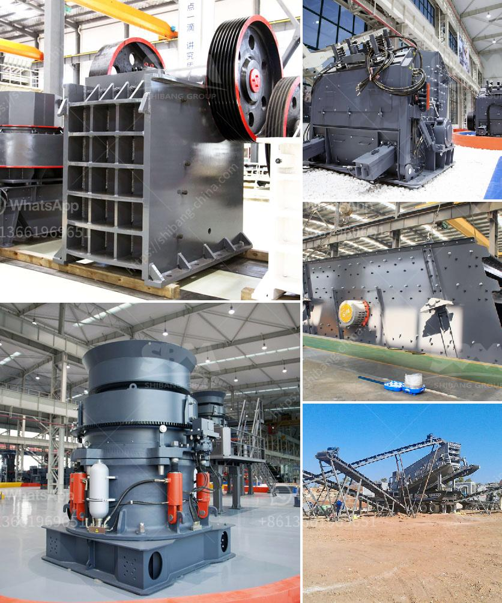

<h3>vibrating screen for recycling costs</h3>
Vibrating screens are essential tools in the recycling industry. They help separate materials based on their size and shape, ensuring that only the desired components are retained for further processing. These screens are highly efficient, cost-effective, and play a crucial role in reducing the overall recycling costs. In this article, we will explore how vibrating screens contribute to cost savings in the recycling industry.

One of the primary ways vibrating screens reduce recycling costs is by improving efficiency in material separation. The screens are designed with multiple layers of mesh, each with a specific aperture size. As material travels along the screen, smaller particles pass through the mesh while larger ones are retained. This process ensures that the recycling materials are properly sorted, increasing the yield and reducing waste.

By separating the recyclable materials based on size and shape, vibrating screens also help reduce the volume of waste that needs to be processed further. Smaller particles, such as dust and fine debris, can be eliminated early in the process, reducing the need for additional sorting or cleaning stages. This not only saves time but also minimizes the requirement for additional equipment, enabling cost savings.

Moreover, vibrating screens are highly versatile and can be utilized for various recycling processes. They can efficiently handle a wide range of materials, including plastics, metals, aggregates, and even organic waste. This versatility eliminates the need for separate screening equipment for different recycling streams, further reducing capital investment and operational costs.

In addition to material separation, vibrating screens also play a crucial role in improving the quality of recyclable materials. These screens can effectively remove impurities, such as dirt, debris, and contaminants, during the screening process. By eliminating unwanted materials, the quality of the recycled products is enhanced, making them more desirable in the market and potentially increasing their value.

The maintenance and operating costs associated with vibrating screens are relatively low, contributing to overall cost savings in the recycling industry. The screens are designed to withstand heavy-duty use and are less prone to mechanical failures. Additionally, they require minimal lubrication, reducing the need for frequent maintenance. These factors, combined with their energy efficiency, make vibrating screens a cost-effective option for recycling facilities.

It is important to note that investing in high-quality vibrating screens can have a significant impact on long-term cost savings. Poorly constructed or substandard screens may result in frequent breakdowns, higher maintenance costs, and reduced efficiency. Therefore, recycling facilities should prioritize investing in robust, reliable, and durable vibrating screens to maximize their cost savings potential.

In conclusion, vibrating screens are integral to reducing recycling costs in the industry. They enhance efficiency, increase the yield of valuable materials, reduce waste volume, improve product quality, and have low maintenance and operating costs. Investing in high-quality vibrating screens ensures long-term cost savings for recycling facilities. With their numerous benefits, these screens are indispensable tools in the pursuit of a more sustainable and economically viable recycling sector.
<h3>Contact us</h3><ul><li><strong>Whatsapp:&nbsp;<a href="https://wa.me/8613661969651">+8613661969651</a></strong></li><li><a href="https://swt.shibang-china.com/?git&amp;zhl&amp;vibrating screen for recycling costs"><strong>Online Service(chat now)</strong></a></li></ul><h3>Related</h3><ul><li><a href='cement factory for sale india.md'>cement factory for sale india</a></li><li><a href='cement grinding machinery europe.md'>cement grinding machinery europe</a></li><li><a href='pe 400 by 600 single toggle jaw crusher specifications.md'>pe 400 by 600 single toggle jaw crusher specifications</a></li><li><a href='granite crushing machine for sale.md'>granite crushing machine for sale</a></li><li><a href='sayaji crusher pdf.md'>sayaji crusher pdf</a></li></ul>