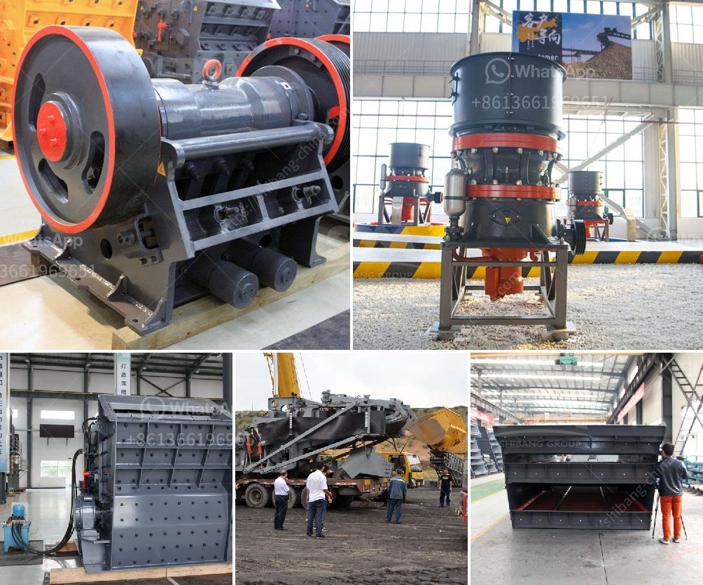

<h3>vibrating screen peru</h3>
Peru, known for its rich mineral resources and growing industrial sector, has been witnessing a significant surge in the demand for vibrating screens. These screens play a crucial role in several industries, including mining, construction, and recycling, among others. The vibrating screen market in Peru is projected to grow exponentially in the coming years, thanks to the various advantages offered by these equipment.

Vibrating screens are essential in the mining industry, as they efficiently separate minerals and other valuable materials from unwanted ones. These screens use vibration to sort particles based on their size and ensure a uniform and consistent output. They not only save time and effort but also enhance productivity by eliminating manual sorting processes. Additionally, vibrating screens reduce the risk of damaging valuable minerals due to their gentle sorting mechanism.

Peru's mining industry, known for its diverse minerals, including copper, gold, silver, and zinc, heavily relies on vibrating screens to extract and refine these minerals. The screens aid in the efficient separation of minerals during the screening process, ensuring maximum yield and quality. The growth of the mining industry in Peru has directly contributed to the increased demand for vibrating screens.

Apart from mining, the construction sector in Peru also heavily relies on vibrating screens for various purposes. These screens are crucial in the production of aggregates, which are widely used in the construction industry. Vibrating screens help in the segregation and sizing of aggregates, ensuring a homogeneous mix for concrete production. Their high efficiency and accuracy make them an indispensable tool in the construction sector.

Recycling is another industry where vibrating screens find extensive use. Peru has been taking significant strides in waste management and recycling in recent years. Vibrating screens are utilized to separate and classify waste materials based on their size and composition. They help in the recovery of valuable recyclable materials and reduce the volume of waste sent to landfills. Vibrating screens play a crucial role in recycling facilities, ensuring optimal separation and sorting of different materials.

In recent years, technological advancements have resulted in the development of more efficient and versatile vibrating screens. These screens come equipped with enhanced features like variable speed, adjustable amplitude, and advanced screening technologies. These advancements have further fueled the demand for vibrating screens in Peru, as industries seek more sophisticated and reliable equipment.

Moreover, Peru's strong economic growth and increasing investments in infrastructure development have provided a further boost to the vibrating screen market. The need for high-quality construction materials and efficient mineral extraction has created a conducive environment for the growth of the vibrating screen industry.

In conclusion, the vibrating screen market in Peru is witnessing exponential growth due to its industrial demands. These screens are indispensable in the mining, construction, and recycling sectors, enhancing efficiency, productivity, and quality. As Peru continues to witness economic growth and investments in infrastructure development, the demand for vibrating screens is expected to soar in the coming years. It is an opportune time for companies in the vibrating screen industry to invest and expand their reach in the Peruvian market.
<h3>Contact us</h3><ul><li><strong>Whatsapp:&nbsp;<a href="https://wa.me/8613661969651">+8613661969651</a></strong></li><li><a href="https://swt.shibang-china.com/?git&amp;zhl&amp;vibrating screen peru"><strong>Online Service(chat now)</strong></a></li></ul><h3>Related</h3><ul><li><a href='fluorite processing.md'>fluorite processing</a></li><li><a href='price of granite crusher tons per hour.md'>price of granite crusher tons per hour</a></li><li><a href='how to crush granite to powder.md'>how to crush granite to powder</a></li><li><a href='coal crushing machine in east rand.md'>coal crushing machine in east rand</a></li><li><a href='coconut shell powder mill machinery maker in sri lanka.md'>coconut shell powder mill machinery maker in sri lanka</a></li></ul>