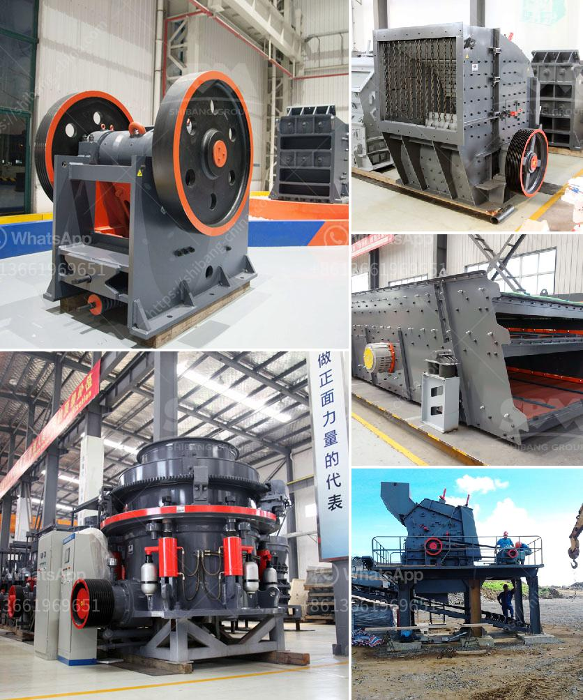

<h3>vibrating screens 250tph</h3>
Vibrating screens play a crucial role in many industrial processes, screening a wide range of materials to separate and grade them according to size. They are commonly used in the mining, construction, and recycling industries, allowing bulk materials to be efficiently sorted and classified.

A vibrating screen operates by gently shaking or vibrating the screen to move particles along the surface. The vibrations are generated by a motor, which creates a linear motion that causes the material to be passed over the screen and dispersed in various layers. This process enables the separation of oversized particles from the desired size fractions.

The capacity of a vibrating screen is often measured in terms of the throughput or the tph (tonnes per hour). A vibrating screen with a capacity of 250 tph indicates that it can screen at least 250 tons of material per hour. This capacity is often determined by the size and composition of the material being processed, as well as the size and design of the screen itself.

The 250 tph vibrating screen typically operates at an inclination angle of 15 degrees, which creates a screening motion of both horizontal and vertical forces. This dual motion increases the efficiency of the screen, allowing it to effectively screen a wide variety of materials. Additionally, the screen is equipped with multiple layers of screens with different mesh sizes, further enhancing the screening process.

When selecting a vibrating screen for a 250 tph application, it is important to consider factors such as the type of material being screened, the desired size fractions, as well as the required efficiency and throughput. It is also crucial to choose a reliable and durable vibrating screen that can withstand the harsh conditions of the specific application.

In conclusion, vibrating screens are essential equipment in many industrial processes, enabling efficient screening and separation of materials. A vibrating screen with a capacity of 250 tph is suitable for a wide range of applications and offers a reliable and efficient screening solution. By considering the specific requirements of the application, operators can select the right vibrating screen to optimize their processes.
<h3>Contact us</h3><ul><li><strong>Whatsapp:&nbsp;<a href="https://wa.me/8613661969651">+8613661969651</a></strong></li><li><a href="https://swt.shibang-china.com/?git&amp;zhl&amp;vibrating screens 250tph"><strong>Online Service(chat now)</strong></a></li></ul><h3>Related</h3><ul><li><a href='stone crusher philippines.md'>stone crusher philippines</a></li><li><a href='river rock crushing equipment.md'>river rock crushing equipment</a></li><li><a href='how to select machines for stone crushing plant.md'>how to select machines for stone crushing plant</a></li><li><a href='barite crusher manufacturer guatemala.md'>barite crusher manufacturer guatemala</a></li><li><a href='vsi crusher machine.md'>vsi crusher machine</a></li></ul>