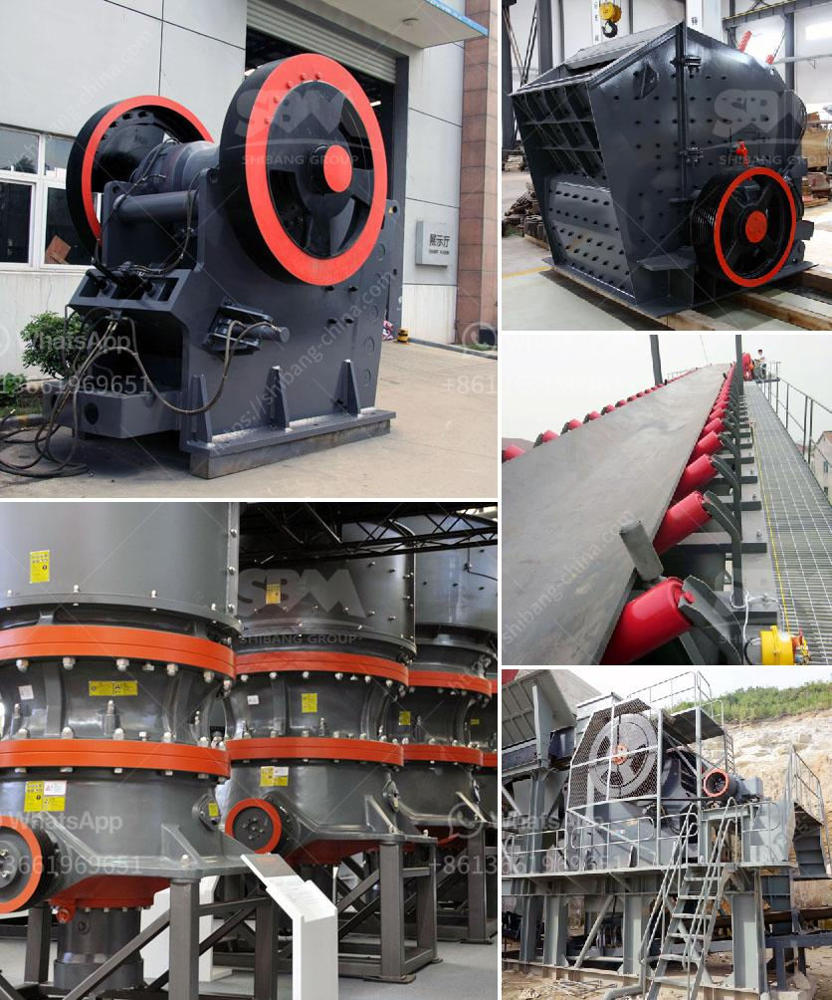

<h3>vibration screen machine</h3>
Vibration screen machines, also known as vibrating screens, are crucial equipment in various industries that involve material handling. Their primary function is to separate the particles of different sizes, allowing for efficient processing and further utilization of materials.

One of the key features of vibration screen machines is their ability to perform high-frequency vibrations. These vibrations apply an effective force to the materials, causing them to move in specific patterns on the screen surface. As a result, materials are separated based on their size and shape, ensuring that each particle finds its right place.

The range of applications for vibration screen machines is extensive. In the mining industry, these machines play a vital role in sorting and classifying different types of minerals and ores. They help extract valuable materials by separating them from unwanted substances such as soil, rocks, and other impurities. Vibration screen machines are also widely used in construction, pharmaceuticals, chemical engineering, and many other fields where material separation is necessary.

One of the significant advantages of vibration screen machines is their versatility. They can handle a wide range of materials, including bulk solids, granules, powders, and even viscous liquids. Additionally, these machines can be customized to meet specific requirements, such as multi-deck screens for multiple particle size separations or screens with special surface patterns for enhanced efficiency.

Furthermore, vibration screen machines are designed with ease of maintenance and operation in mind. They are equipped with user-friendly control panels and ergonomic features to ensure smooth operation and reduce downtime. Regular cleaning and maintenance routines are essential to keep these machines performing at their best and prolong their lifespan.

In conclusion, the vibration screen machine is an indispensable tool in material handling processes. Its efficient separation capabilities enhance productivity and quality in industries ranging from mining to pharmaceuticals. With their versatility and ease of use, these machines continue to play a crucial role in optimizing various material processing operations.
<h3>Contact us</h3><ul><li><strong>Whatsapp:&nbsp;<a href="https://wa.me/8613661969651">+8613661969651</a></strong></li><li><a href="https://swt.shibang-china.com/?git&amp;zhl&amp;vibration screen machine"><strong>Online Service(chat now)</strong></a></li></ul><h3>Related</h3><ul><li><a href='sand washing system.md'>sand washing system</a></li><li><a href='indonesia ball mill.md'>indonesia ball mill</a></li><li><a href='latest chrome crush and wash plant for sale in rsa.md'>latest chrome crush and wash plant for sale in rsa</a></li><li><a href='vibrating screen for recycling costs.md'>vibrating screen for recycling costs</a></li><li><a href='grinding units of feldspar.md'>grinding units of feldspar</a></li></ul>