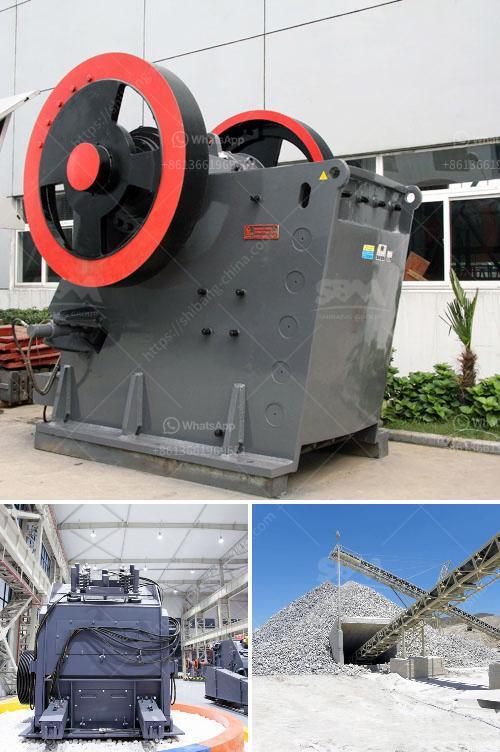

<h3>vsi crusher machine</h3>
The VSI crusher machine is a popular choice for crushing hard and abrasive materials, such as gravel, granite, quartz, silica, basalt, dolomite, limestone, and iron ore. It is able to achieve a crushing ratio of 4:1, thereby providing exceptional output and efficiency. The machine also offers a perfect product shape, which makes it suitable for producing high-quality aggregates for construction and road projects.

One of the key features of the VSI crusher machine is the ability to control the product gradation. This is achieved by varying the rotor speed and cascade ratio, thus allowing the operator to adjust the machine's output and shape of the final product. The advanced hydraulic system further enhances the control over the product gradation, ensuring that desired specifications are met consistently.

The VSI crusher machine also provides excellent reliability and durability. It is built with high-quality materials and components, which ensure its longevity even under tough operating conditions. Additionally, the machine is designed to minimize downtime during maintenance and repairs, further increasing its overall uptime and productivity.

Another advantage of the VSI crusher machine is its versatility. It can be used in various applications, such as aggregate production, mining operations, and recycling of construction materials. The machine is capable of producing different sizes of aggregates, ranging from coarse to fine, making it suitable for a wide range of projects.

Furthermore, the VSI crusher machine offers significant energy savings compared to traditional crushing methods. Its innovative design reduces the energy consumption during the crushing process, leading to lower operating costs. This makes it an economical choice for companies looking to optimize their production and reduce expenses.

In terms of safety, the VSI crusher machine is equipped with advanced safety features. These include a self-lubricating system that prevents overheating and reduces the risk of mechanical breakdowns. The machine also features an automatic overload protection system that prevents damage to the crusher in case of material blockages or excessive loads.

Overall, the VSI crusher machine is a reliable and efficient solution for crushing hard and abrasive materials. Its ability to control product gradation, high-quality output, and energy-saving features make it a valuable asset for various industries. Whether it is used for aggregate production, mining, or recycling, the VSI crusher machine offers exceptional performance and versatility. Companies can rely on this machine to meet their crushing needs effectively and increase their overall productivity.
<h3>Contact us</h3><ul><li><strong>Whatsapp:&nbsp;<a href="https://wa.me/8613661969651">+8613661969651</a></strong></li><li><a href="https://swt.shibang-china.com/?git&amp;zhl&amp;vsi crusher machine"><strong>Online Service(chat now)</strong></a></li></ul><h3>Related</h3><ul><li><a href='germany stone crusher machine factories.md'>germany stone crusher machine factories</a></li><li><a href='mobile screen crusher for sale south africa.md'>mobile screen crusher for sale south africa</a></li><li><a href='blue metal crusher product machine price coimbatore.md'>blue metal crusher product machine price coimbatore</a></li><li><a href='best mobile jaw crusher 30 100tph.md'>best mobile jaw crusher 30 100tph</a></li><li><a href='accounting entry on crushing plant.md'>accounting entry on crushing plant</a></li></ul>