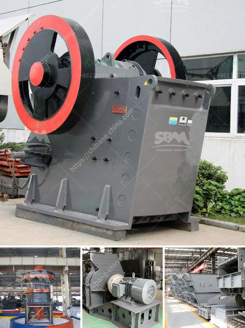

<h3>vsi crusher plant</h3>
The VSI crusher plant, also called vertical shaft impact crusher, is a versatile and powerful crushing machine that can handle different materials and applications. Its main purpose is to provide high-quality sand and gravel aggregates for construction and landscaping projects.

The VSI crusher plant works by breaking stones or rocks into smaller pieces. The material is fed through a hopper into the crusher and then it is accelerated through a high-speed rotor. The rotor throws the material against a hard surface called a wear plate, which then breaks it into smaller pieces. These smaller pieces are further reduced in size as they collide with each other, creating a cascading effect.

One of the key advantages of the VSI crusher plant is its ability to produce cubical-shaped end products. Unlike traditional crushers that produce flaky and elongated particles, the VSI crusher produces well-rounded and evenly graded aggregates. This is crucial in the construction industry, as it ensures the stability and durability of concrete and asphalt structures.

Additionally, the VSI crusher plant offers great flexibility in terms of adjusting the gradation of the end product. By changing the rotor speed or the cascade ratio, operators can fine-tune the output to meet specific requirements. This adaptability is particularly useful in projects with varying specifications, where different sizes of aggregates are needed.

Furthermore, the VSI crusher plant is energy-efficient and cost-effective. Its high-speed rotor consumes less power compared to other crushing machines, resulting in lower operating costs. Additionally, the wear parts of the VSI crusher, such as the wear plate and the anvils, can be easily replaced when they become worn out, reducing downtime and maintenance expenses.

The VSI crusher plant is also environmentally friendly. It produces less noise and dust compared to traditional crushers, making it a preferred choice in urban areas or sensitive environments. Moreover, the plant can be equipped with a dust suppression system, further reducing the emission of dust particles.

In conclusion, the VSI crusher plant is a powerful and versatile crushing machine that is suitable for a variety of materials and applications. Its ability to produce cubical-shaped aggregates and adjust the gradation of the end product makes it highly desirable for construction projects. Additionally, its energy efficiency, low operating costs, and environmental friendliness make it a sustainable choice in the long run. Whether for road construction, building construction, or landscaping projects, the VSI crusher plant is a reliable and effective solution.
<h3>Contact us</h3><ul><li><strong>Whatsapp:&nbsp;<a href="https://wa.me/8613661969651">+8613661969651</a></strong></li><li><a href="https://swt.shibang-china.com/?git&amp;zhl&amp;vsi crusher plant"><strong>Online Service(chat now)</strong></a></li></ul><h3>Related</h3><ul><li><a href='basalt crushing plant.md'>basalt crushing plant</a></li><li><a href='cement grinding mill manufacturer india.md'>cement grinding mill manufacturer india</a></li><li><a href='complete crusher plant for sale south africa.md'>complete crusher plant for sale south africa</a></li><li><a href='36 jaw crusher for rent edmonton.md'>36 jaw crusher for rent edmonton</a></li><li><a href='raymond mill from china best supplier on sale.md'>raymond mill from china best supplier on sale</a></li></ul>