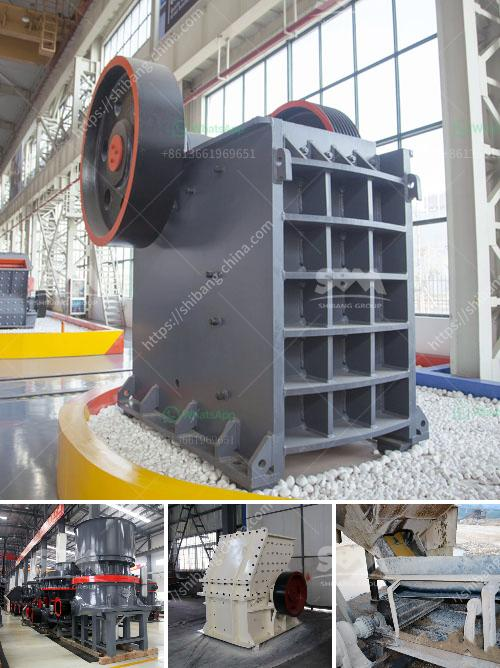

<h3>vsi crusher plants in uae</h3>
With the rapid growth of the construction industry in the UAE, the demand for quality aggregates is escalating. To meet this increasing demand, crushing plants are being established across the region, consisting of crushers, screens, conveyors, and magnetic separators, with the occasional use of metal detectors. These crushers are specifically designed to produce high-quality aggregates for various uses in construction, including concrete, asphalt, and road base.

Among the various types of crushers available in the market, VSI (Vertical Shaft Impactor) crushers have gained immense popularity and are widely used in the UAE. VSI crushers have a unique rock-on-rock crushing principle, which gives high efficiency and excellent cubic shape with a low percentage of fines. This enables the production of high-quality end products in a cost-effective manner. VSI crusher plants in the UAE utilize the latest technology and deliver outstanding performance.

1. Greater production capacity – Due to the unique rock-on-rock crushing principle, VSI crushers efficiently produce high-quality aggregates with excellent cubicity. This enhances the overall production capacity of the plant, enabling higher output and meeting the increasing demand for aggregates.

2. Precise particle shape and size – VSI crushers produce aggregates with precise particle shape and size distribution, resulting in better workability of concrete and improved compaction properties of asphalt. The consistent particle shape ensures higher strength and durability of the construction materials.

3. Low operation and maintenance costs – VSI crushers are known for their low operating costs and minimal maintenance requirements. They are equipped with advanced automation systems that optimize the crusher's performance, reduce wear and tear, and provide real-time monitoring and control.

4. Easy integration with existing crushing plants – VSI crusher plants can be easily integrated into existing crushing plants, allowing operators to upgrade their operations and increase production without replacing the entire crushing setup. This flexibility reduces downtime and capital investment, making VSI crushers a cost-effective solution for aggregate recycling.

5. Environmentally friendly – VSI crusher plants are designed to minimize environmental impact. They generate low noise levels and have dust suppression systems in place to prevent air pollution. Additionally, the use of VSI crushers reduces the need for natural aggregates, preserving natural resources.

In conclusion, VSI crusher plants in the UAE are the perfect solution for aggregate recycling. Their exceptional features maximize efficiency and productivity while minimizing operation and maintenance costs. With the growing demand for quality aggregates in the construction industry, VSI crushers play a pivotal role in meeting this demand by producing high-quality aggregates with precise particle size and shape distribution. Moreover, their easy integration with existing crushing plants and environmentally friendly design make them a sustainable choice for aggregate production. It is evident that VSI crusher plants have revolutionized the UAE's aggregate industry and will continue to do so in the future.
<h3>Contact us</h3><ul><li><strong>Whatsapp:&nbsp;<a href="https://wa.me/8613661969651">+8613661969651</a></strong></li><li><a href="https://swt.shibang-china.com/?git&amp;zhl&amp;vsi crusher plants in uae"><strong>Online Service(chat now)</strong></a></li></ul><h3>Related</h3><ul><li><a href='calcite grinding plant.md'>calcite grinding plant</a></li><li><a href='crusher hpt cone crusher price.md'>crusher hpt cone crusher price</a></li><li><a href='typical particle size of roll crusher.md'>typical particle size of roll crusher</a></li><li><a href='hammer mill south africa.md'>hammer mill south africa</a></li><li><a href='calculations for belt conveyor structural bents.md'>calculations for belt conveyor structural bents</a></li></ul>