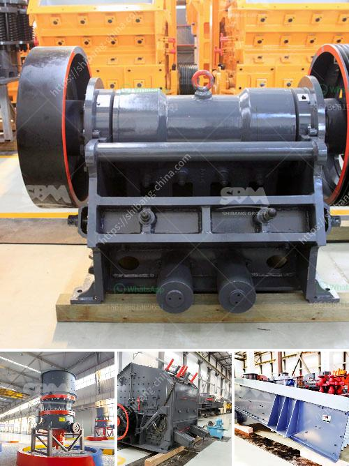

<h3>vsi crusher suppliers in europe</h3>
At present, the European region is the largest market for VSI crushers. In terms of revenue, Germany is expected to dominate the market due to the heavy investments in the construction industry. France and UK are also anticipated to witness significant growth during the forecast period.

The key reason behind the strong demand for VSI crushers in Europe is the increasing adoption of sustainable construction practices. VSI crushers are widely used in the crushing industry for the production of cubical-shaped aggregates and manufactured sand. With the stringent environmental regulations and high-quality standards, the demand for these machines is expected to rise rapidly.

In the European market, there are several VSI crusher suppliers and manufacturers that operate their business across the region. These suppliers cater to the diverse needs of the construction industry by offering a wide range of crushing machines. Some of the prominent VSI crusher suppliers in Europe include:

Sandvik is a global supplier of crushing equipment used in the construction, mining, and aggregate industries. The company offers a comprehensive range of VSI crushers, including rock-on-rock, rotor and anvil, and shoe and anvil configurations. Sandvik's crushers are renowned for their high performance, reliability, and versatility.

Metso is a leading manufacturer of crushing equipment and also provides service solutions for the mining and construction industries. The company offers a wide range of VSI crushers, including autogenous and semi-autogenous crushers. Metso's VSI crushers are known for their advanced technology and efficient performance.

Terex Corporation is a global manufacturer of lifting and material processing products. The company offers a range of VSI crushers under its brand name Powerscreen. These crushers are designed to deliver high performance and reliability in various applications, including construction aggregates, mining, and demolition waste recycling.

Keestrack NV is a leading manufacturer of mobile crushing and screening equipment. The company offers a range of VSI crushers that are suitable for different applications, including recycling, mining, and construction. Keestrack's crushers are known for their innovative features and excellent performance.

SMA Mineral is a leading supplier of industrial minerals, including crushed limestone aggregates. The company offers a range of VSI crushers that are specifically designed for the production of high-quality manufactured sand. SMA Mineral's crushers are known for their superior efficiency and reliability.

In conclusion, the demand for VSI crushers in Europe is expected to grow significantly in the coming years. With the stringent environmental regulations and increasing focus on sustainable construction practices, there is a strong need for high-quality aggregates and manufactured sand. The market is dominated by several reliable and reputed suppliers, who offer a wide range of crushing machines to cater to the diverse needs of the construction industry. As the demand increases, these suppliers are likely to further enhance their product portfolio and provide advanced solutions to their customers.
<h3>Contact us</h3><ul><li><strong>Whatsapp:&nbsp;<a href="https://wa.me/8613661969651">+8613661969651</a></strong></li><li><a href="https://swt.shibang-china.com/?git&amp;zhl&amp;vsi crusher suppliers in europe"><strong>Online Service(chat now)</strong></a></li></ul><h3>Related</h3><ul><li><a href='hand crank oyster shell crusher.md'>hand crank oyster shell crusher</a></li><li><a href='graphite beneficiation plant at nigeria.md'>graphite beneficiation plant at nigeria</a></li><li><a href='how to build a gold wash plant.md'>how to build a gold wash plant</a></li><li><a href='manufacturer of slag roller crusher in philippines.md'>manufacturer of slag roller crusher in philippines</a></li><li><a href='manufacturer of quartz powder in india.md'>manufacturer of quartz powder in india</a></li></ul>