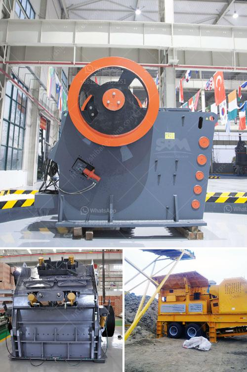

<h3>vsi crusher vertical shaft impact crusher</h3>
Sand making machine, also known as vertical shaft impact crusher, is the best equipment for producing sand and stones in the construction industry. It is found in every project that requires fine crushing, such as highways, railways, and water conservancy. VSI crusher is widely used in crushing and reshaping of rocks and artificial sand production. It is suitable for crushing of fragile materials below level 9 of Moh's hardness, rather than viscous materials or stone materials containing much solid.

VSI crusher operates on the principle of stone hitting stone, which provides low wear costs and maximizes the reduction of abrasive rocks. It is further equipped with grease lubrication system, ensuring stable operation, and easy maintenance. Numerous feed modes are available to accommodate different crushing requirements, including rock-on-rock, rock-on-iron, and rock-on-anvil. The VSI crusher combines high velocity impact crushing with high pressure attrition grinding, to produce high volumes of cubically shaped product.

1. High Efficiency: The use of the principle of stone hitting stone ensures the efficiency of the equipment, and the shaping particle size is more uniform.

2. Reliable Operation: It adopts the world-class manufacturing process, and the selected high-quality materials ensure the equipment's resistance to wear and reliable operation.

3. Adjustable particle size: The crusher can selectively adjust the particle size based on customer requirements, avoiding the excessive material content that does not meet the requirements of the construction industry.

4. Easy Maintenance: The wearing parts of the VSI crusher are made of highly wear-resistant materials, which greatly reduces the maintenance workload and improves the service life of the equipment.

5. Low operating cost: The use of high-quality wear-resistant materials and energy-saving technologies greatly reduces the operating cost of the entire production line.

1. Artificial Sand Making: The VSI crusher can provide high-quality sand and aggregates for the construction industry, as well as artificially produced stone materials for pavement stones, hydropower projects, and other industries.

2. Shaping of Stones: In the crushing process, the VSI crusher can shape the crushed stones into cubical-shaped aggregates, which can be widely used for road construction, buildings, and other applications.

3. Ore Crushing: The VSI crusher can also be used for crushing various ores, rocks, and minerals. It is suitable for medium and fine crushing operations of different hardness materials.

The VSI crusher, with its excellent performance and wide range of applications, has become one of the most popular crushing equipment in the construction industry. It provides high-quality sand and aggregates for various construction projects while contributing to environmental protection through its energy-saving and efficient operation. With its reliability, easy maintenance, and low operating costs, the VSI crusher will continue to play a vital role in the construction industry as the best machine for sand making.
<h3>Contact us</h3><ul><li><strong>Whatsapp:&nbsp;<a href="https://wa.me/8613661969651">+8613661969651</a></strong></li><li><a href="https://swt.shibang-china.com/?git&amp;zhl&amp;vsi crusher vertical shaft impact crusher"><strong>Online Service(chat now)</strong></a></li></ul><h3>Related</h3><ul><li><a href='crusher for limestone.md'>crusher for limestone</a></li><li><a href='3 raymond roller mill.md'>3 raymond roller mill</a></li><li><a href='granite milling unit.md'>granite milling unit</a></li><li><a href='hammer mill crusher type.md'>hammer mill crusher type</a></li><li><a href='pe 400 by 600 single toggle jaw crusher specifications.md'>pe 400 by 600 single toggle jaw crusher specifications</a></li></ul>