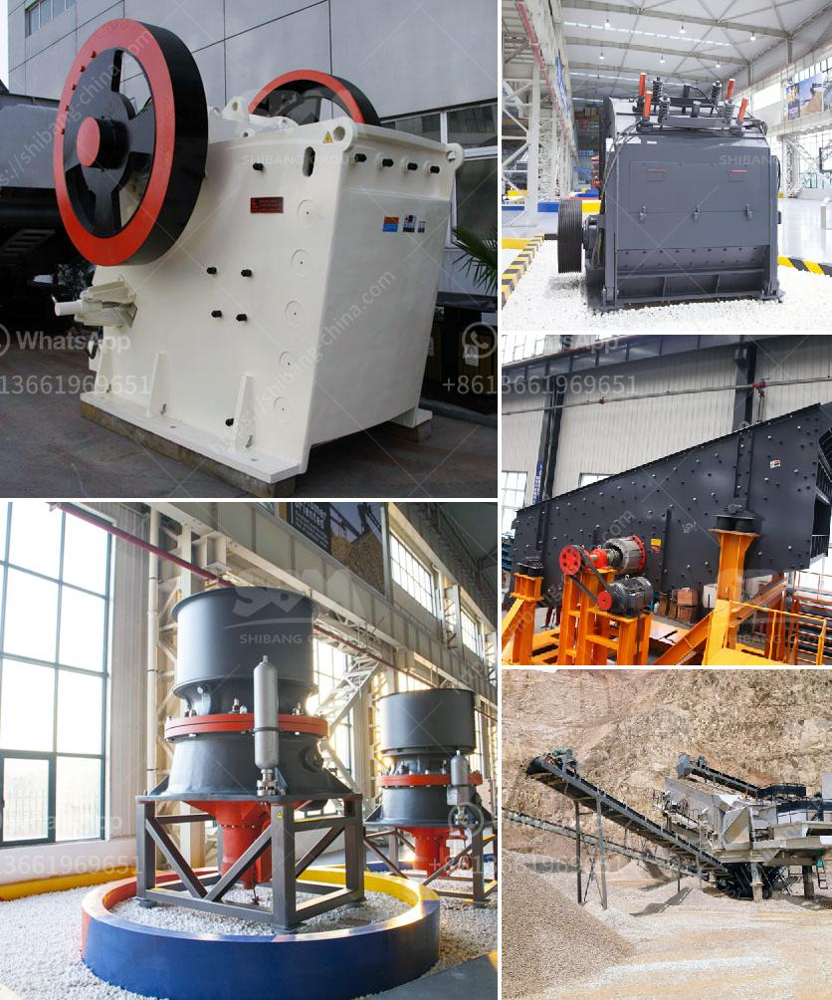

<h3>want to increase productivity for stone crushers</h3>
Stone crushing is a crucial and intricate activity that involves crushing rocks into smaller stones. These stones are used for various purposes, such as constructing roads, building structures, and producing concrete. Unfortunately, the stone crushing process is also known for generating dust and noise. To improve productivity for stone crushers, it is essential to reduce the amount of dust and noise produced by the crushing process, minimize maintenance requirements, and lower energy consumption.

One effective way to increase productivity is to use mechanized equipment. Traditional hand-crushing methods are time-consuming and require a lot of physical effort. Mechanized stone crushers, on the other hand, are designed to crush stones with more efficiency and less effort. They also produce less dust and noise, making them more environmentally friendly.

Regular maintenance of stone crushers is crucial to ensure their optimum functionality. Regularly inspecting and replacing worn-out parts such as hammers, screens, and bearings can significantly improve the productivity and lifespan of stone crushers. Additionally, proper maintenance practices should be followed, including lubricating the moving parts, cleaning and tightening connections, and inspecting the electrical system.

Investing in high-quality equipment is another key factor in increasing productivity. High-quality stone crushers are equipped with modern technology, enabling them to complete complex tasks with ease and achieve optimal results. By investing in a high-quality stone crusher, businesses can decrease downtime and increase productivity, ensuring the success of their operations.

Reducing dust and noise pollution is another important aspect of improving productivity for stone crushers. Properly designed enclosures or shelters can help to minimize the dust and noise pollution caused by the crushing process. Additionally, using water sprayers and dust suppression systems can reduce the amount of dust generated during the crushing process, creating a healthier and safer working environment.

Implementing energy-efficient practices is not only beneficial for the environment but also increases productivity. Investing in energy-efficient equipment, such as electric stone crushers, can significantly reduce energy consumption and operating costs. Electric stone crushers are more cost-effective and environmentally friendly, as they do not require fuel and have less environmental impact compared to diesel-powered crushers.

Moreover, implementing proper training programs for workers can enhance productivity. Well-trained operators can utilize the equipment more efficiently, reducing the chances of downtime and accidents. Training programs should focus on safety practices, equipment operation, and maintenance procedures, ensuring that workers have the necessary skills to maximize productivity while maintaining a safe working environment.

In conclusion, increasing productivity for stone crushers can be achieved through various means. Investing in mechanized equipment, conducting regular maintenance, and using high-quality and energy-efficient crushers are essential steps. Moreover, reducing dust and noise pollution, properly training workers, and implementing modern technologies can significantly enhance productivity. By implementing these strategies, businesses can improve their stone crushing operations, reducing downtime, and increasing profitability.
<h3>Contact us</h3><ul><li><strong>Whatsapp:&nbsp;<a href="https://wa.me/8613661969651">+8613661969651</a></strong></li><li><a href="https://swt.shibang-china.com/?git&amp;zhl&amp;want to increase productivity for stone crushers"><strong>Online Service(chat now)</strong></a></li></ul><h3>Related</h3><ul><li><a href='conveyor belt consultants.md'>conveyor belt consultants</a></li><li><a href='stone crushing machines for sale in philippines.md'>stone crushing machines for sale in philippines</a></li><li><a href='gypsum calcination equipment.md'>gypsum calcination equipment</a></li><li><a href='how much investment in bauxite crushing plant.md'>how much investment in bauxite crushing plant</a></li><li><a href='rock crusher for sale in sudan.md'>rock crusher for sale in sudan</a></li></ul>