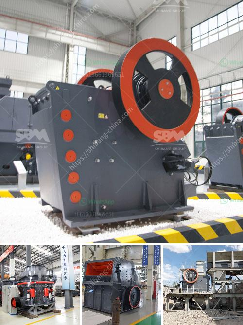

<h3>washing powder production line</h3>
In today's fast-paced world, doing laundry efficiently has become a necessity for many individuals and households. As a result, the demand for washing powder has increased substantially, prompting manufacturers to invest in high-speed and automated production lines for seamless manufacturing. A washing powder production line ensures effective, consistent, and cost-efficient production of laundry detergents.

A washing powder production line comprises various processing stages that involve raw material storage, dosing, mixing, and packaging. Each stage plays a crucial role in ensuring the quality and efficiency of the final product. Let's take a closer look at each stage and the benefits of utilizing a production line.

Raw Material Storage: The first stage of the production line involves the storage of raw materials. This may include surfactants, builders, enzymes, fragrances, and other additives. Utilizing a production line allows for better organization, control, and easy access to the required raw materials. A properly designed storage system ensures the integrity of the materials, preventing contamination and deterioration, resulting in a high-quality end product.

Dosing: Accurate dosing of raw materials is vital to ensure the desired composition and effectiveness of the washing powder. In a production line, automated dosing systems precisely measure and dispense the required amounts of each ingredient. This eliminates human error and guarantees consistency in the formula, leading to a uniform and effective detergent.

Mixing: The blending of raw materials in the correct proportions is essential to achieve a homogeneous and well-performing washing powder. A production line incorporates high-speed and advanced mixing equipment that ensures thorough and efficient blending. With automated control systems, manufacturers can adjust mixing parameters to achieve the desired texture and particle size for optimal product performance.

Packaging: Once the washing powder is ready, efficient packaging is necessary to ensure convenient usage for consumers. A production line integrates automated packaging machinery that can handle various bag sizes, types, and materials. It enables accurate weighing, filling, and sealing, resulting in properly packed products. Additionally, advanced systems can incorporate label printing and application for efficient branding and product identification.

The benefits of utilizing a washing powder production line are undeniable. Firstly, automation reduces labor costs and increases productivity, allowing manufacturers to meet the growing demand efficiently. Moreover, automated systems improve product consistency and uniformity, ensuring that consumers receive reliable and effective laundry detergents every time they purchase a product.

By streamlining the production process, a washing powder production line minimizes the chances of errors and discrepancies, thus reducing the occurrence of faulty or substandard products. This helps build trust and loyalty among consumers, further enhancing the brand's reputation.

In conclusion, a washing powder production line offers numerous advantages to manufacturers, including improved efficiency, product consistency, and cost-effectiveness. Investing in a production line ensures that the production process is streamlined, guaranteeing high-quality laundry detergents that meet the demands of modern consumers. With the ever-increasing need for efficient cleaning solutions, the utilization of a washing powder production line is a sound investment for manufacturers in the laundry detergent market.
<h3>Contact us</h3><ul><li><strong>Whatsapp:&nbsp;<a href="https://wa.me/8613661969651">+8613661969651</a></strong></li><li><a href="https://swt.shibang-china.com/?git&amp;zhl&amp;washing powder production line"><strong>Online Service(chat now)</strong></a></li></ul><h3>Related</h3><ul><li><a href='copper recycling process.md'>copper recycling process</a></li><li><a href='sand washer for price.md'>sand washer for price</a></li><li><a href='second hand stone crushing machines in united kingdom.md'>second hand stone crushing machines in united kingdom</a></li><li><a href='usinas de asfalto para venda em angola.md'>usinas de asfalto para venda em angola</a></li><li><a href='single super phosphate plants in germany.md'>single super phosphate plants in germany</a></li></ul>