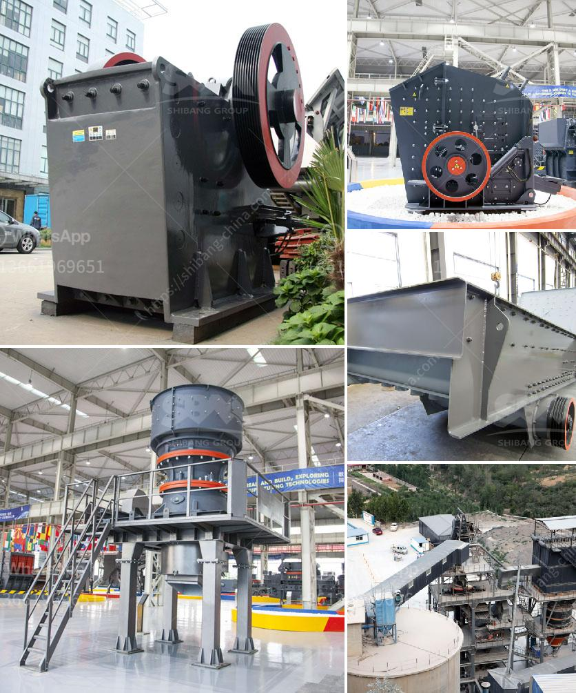

<h3>were to buy old rock crusher</h3>
Are you a part of the construction or mining industry and need to crush rocks on a regular basis? Perhaps you are a DIY enthusiast who loves to build things at home and need a rock crusher to add to your collection. No matter the reason, if you are looking to buy an old rock crusher, there are several places you can explore.

First and foremost, one of the best places to find old rock crushers is at antique auctions. Many of the participants in these auctions are enthusiasts who have spent years collecting antique machinery. These auctions are a treasure trove for those looking for vintage rock crushers. You can find a wide range of options, from early models with manual operation to more advanced crushers powered by gas or electricity. Not only will you find unique and special pieces, but you may also enjoy learning about the history and mechanics of these fascinating machines.

Online marketplaces are also excellent sources to find old rock crushers. Platforms such as eBay, Craigslist, and Facebook Marketplace have a wide variety of listings for used machinery, including rock crushers. Take your time to browse through the options and compare prices and conditions. It is advisable to reach out to the sellers and ask questions about the condition, maintenance history, and any specific features or accessories included with the crusher.

Additionally, you can check with local construction and mining companies in your area. These companies may have retired equipment or crushers that are no longer in use. They might be willing to sell or even donate their old rock crushers, as they would rather see them being put to use than ending up in a landfill. Networking with professionals in the industry can lead to great finds and potentially even cost-saving deals.

Another option is to attend trade shows and conferences related to the construction and mining industry. These events often have exhibitors showcasing their latest machinery and equipment. However, you may find that some of these exhibitors have older models for sale at discounted prices. Engage in conversations with the representatives, express your interest in an old rock crusher, and explore the possibility of purchasing one from the exhibitors.

Before purchasing an old rock crusher, remember to thoroughly inspect it. Check for any damage, rust, or worn-out parts. Verify that all the necessary components are included, such as belts, pulleys, and motors. It is also advisable to ask for any available maintenance or service records. If the machinery requires any repairs or replacements, consider the costs and whether it is a feasible investment.

In conclusion, finding old rock crushers can be an exciting and rewarding process. Whether you prefer antique auctions, online marketplaces, or networking with professionals in the industry, there are various avenues to explore. When purchasing an old rock crusher, ensure that you inspect it thoroughly and weigh the costs of any necessary repairs or replacements. With a little diligence and research, you can find a dependable and authentic piece of machinery to add to your collection or use for your construction or mining needs.
<h3>Contact us</h3><ul><li><strong>Whatsapp:&nbsp;<a href="https://wa.me/8613661969651">+8613661969651</a></strong></li><li><a href="https://swt.shibang-china.com/?git&amp;zhl&amp;were to buy old rock crusher"><strong>Online Service(chat now)</strong></a></li></ul><h3>Related</h3><ul><li><a href='project report clay brick manufacturing.md'>project report clay brick manufacturing</a></li><li><a href='bauxite production line in germany.md'>bauxite production line in germany</a></li><li><a href='dolomite crushing plant in bharuch.md'>dolomite crushing plant in bharuch</a></li><li><a href='accounting entry on crushing plant.md'>accounting entry on crushing plant</a></li><li><a href='cost of tph stage crushing plant.md'>cost of tph stage crushing plant</a></li></ul>