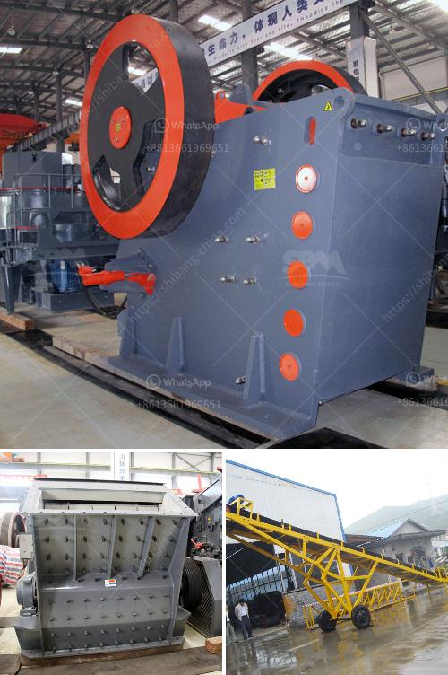

<h3>wet grinding of mica process and equipment</h3>
Mica, an important industrial mineral, can be found in many countries across the globe. It is widely used in various industries such as cosmetics, paint, plastic, rubber, and electrical insulation. To obtain high-quality mica powder, mica wet grinding process is necessary.

The wet grinding process involves the mica ore being fed into a wet grinding mill, where water and grinding aids are added to achieve the desired particle size distribution. In the wet grinding mill, additional mechanical forces such as centrifugal forces and fluid-particle interactions also play a significant role in the final product quality.

The wet grinding process is preferred over dry grinding due to various advantages. Firstly, it helps to reduce the particle size distribution of the mica ore, which enhances the delamination process. Delamination of mica refers to the splitting of the mica layers into thin sheets, resulting in a higher aspect ratio and improved properties such as increased flexibility and thermal conductivity.

Secondly, the wet grinding process helps to minimize the loss of mica during the grinding and separation stages. Mica tends to flake off when subjected to excessive mechanical forces, leading to a loss of product quality. The presence of water and grinding aids in the wet grinding process helps to reduce the friction between the mica particles and the grinding media, preventing excessive flaking and ensuring a higher recovery rate of valuable mica.

In terms of equipment, a wet grinding mill is essential for the wet grinding process of mica. The mill used must have the capability to process the high viscosity and moisture content of mica without clogging. The wet grinding mill commonly used in the mica industry features a combination of three forces: fluid-particle interactions, centrifugal forces, and gravity. These forces work together to achieve the desired particle size reduction and promote the delamination process.

Apart from the wet grinding mill, other equipment is also crucial for the wet grinding process of mica. This includes water supply systems, grinding aids dosing systems, and separation equipment. Water supply systems ensure a constant supply of water during the grinding process, while grinding aids dosing systems control the addition of grinding aids to optimize the grinding efficiency. Lastly, separation equipment such as hydrocyclones or magnetic separators are used to separate the ground mica particles from the grinding slurry.

To summarize, the wet grinding of mica process is a vital step in obtaining high-quality mica powder. It offers advantages such as particle size reduction, delamination, and improved recovery rates. The key equipment involved in the process includes a wet grinding mill, water supply systems, grinding aids dosing systems, and separation equipment. With the proper process and equipment, manufacturers can achieve the desired mica particle size distribution and produce high-quality mica powder for various industrial applications.
<h3>Contact us</h3><ul><li><strong>Whatsapp:&nbsp;<a href="https://wa.me/8613661969651">+8613661969651</a></strong></li><li><a href="https://swt.shibang-china.com/?git&amp;zhl&amp;wet grinding of mica process and equipment"><strong>Online Service(chat now)</strong></a></li></ul><h3>Related</h3><ul><li><a href='list of gold mining company in zimbabwe.md'>list of gold mining company in zimbabwe</a></li><li><a href='blue metal crusher product machine price coimbatore.md'>blue metal crusher product machine price coimbatore</a></li><li><a href='mining crusher for gold mining.md'>mining crusher for gold mining</a></li><li><a href='hammer mill supplier in pretoria.md'>hammer mill supplier in pretoria</a></li><li><a href='calcium carbonate mines in pakistan.md'>calcium carbonate mines in pakistan</a></li></ul>