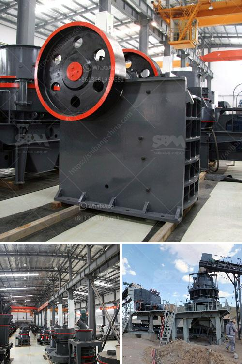

<h3>wet process feldspar supplier</h3>
Wet process feldspar suppliers play a crucial role in the ceramic and glass industries. Feldspar is a common raw material used in the production of these materials due to its unique properties and versatility. The wet process is one of the commonly employed methods to extract feldspar from deposits and refine it for commercial use.

A wet process feldspar supplier specializes in extracting feldspar through wet mining operations. This process involves the use of water to separate the feldspar mineral from the surrounding rock and impurities. After the initial extraction, the wet process supplier further purifies the feldspar through various stages of washing, grinding, and magnetic separation. These steps help to remove any remaining impurities, ensuring a high-quality and consistent end product.

The wet process feldspar supplier provides a reliable source of feldspar for industries such as ceramics, glass, and paints. In ceramics, feldspar acts as a fluxing agent, helping to lower the melting point of the materials and promoting vitrification. This property is particularly important in the production of porcelain, where the addition of feldspar enables the formation of a dense, non-porous product. In the glass industry, feldspar is used as a fluxing agent to reduce the melting temperature, improve the strength and durability of the glass, and enhance its transparency.

Choosing the right wet process feldspar supplier is essential for businesses in the ceramic and glass industries. A reliable supplier should have a consistent supply of high-quality feldspar, ensuring a steady production process. They should also offer competitive prices, as the cost of raw materials significantly impacts the overall manufacturing expenses.

Additionally, a trustworthy supplier should have a good understanding of the specific requirements and regulations of the industries they serve. They should prioritize environmental sustainability and employ responsible mining practices to minimize the ecological impact of their operations.

In conclusion, wet process feldspar suppliers play a vital role in providing the ceramic and glass industries with a consistent supply of high-quality feldspar. Their expertise in wet mining operations and refining processes ensures the production of feldspar that meets the stringent requirements of various industries. By partnering with a reliable and responsible wet process feldspar supplier, businesses can enhance their manufacturing processes and achieve excellent product quality.
<h3>Contact us</h3><ul><li><strong>Whatsapp:&nbsp;<a href="https://wa.me/8613661969651">+8613661969651</a></strong></li><li><a href="https://swt.shibang-china.com/?git&amp;zhl&amp;wet process feldspar supplier"><strong>Online Service(chat now)</strong></a></li></ul><h3>Related</h3><ul><li><a href='vertical grinding machine.md'>vertical grinding machine</a></li><li><a href='plant crushing materials in antioquia.md'>plant crushing materials in antioquia</a></li><li><a href='rock crusher in africa.md'>rock crusher in africa</a></li><li><a href='used crushers in america.md'>used crushers in america</a></li><li><a href='andhra pradesh coal crusher equipment price.md'>andhra pradesh coal crusher equipment price</a></li></ul>