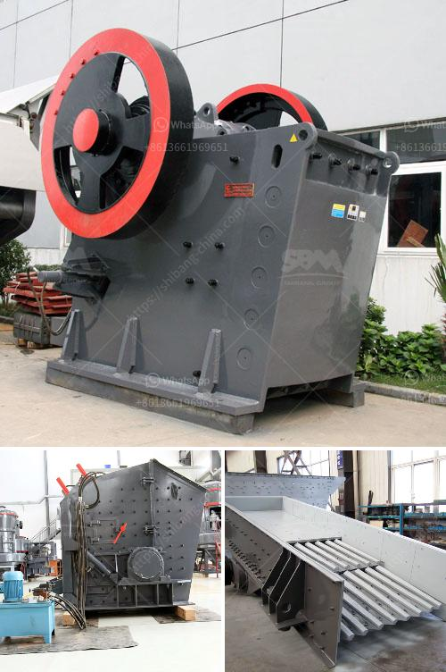

<h3>what is the meaning of 100tph in crusher crusher</h3>
Crusher refers to the equipment that reduces the particle size of material by the action of external force. Crusher's are widely used in mining, highway, building materials, metallurgy, and chemical industries. Different types of crushers have different working principles, such as jaw crushers, impact crushers, and cone crushers.

Among them, the main crushing equipment in the crusher industry is jaw crusher. It is mainly used for medium-sized crushing of various ores and bulk materials. According to the characteristics of the crushed materials, the capacity of the jaw crusher equipment can reach 100tph. This refers to the capacity of the crusher machine, thus the crushing capacity could be influenced by different material properties.

The operation of the crusher machine plays a crucial role in the efficiency and productivity of the crushing process. In order to achieve a higher crushing ratio and obtain more fine-grained products, it is necessary to adjust and control the crushing process parameters correctly. However, the actual crushing capacity of a crusher is often limited by various factors including material properties, equipment performance, and operational factors.

When considering the capacity of a crusher, it is essential to understand that the 100tph refers to the theoretical maximum capacity, which is often affected by operational constraints. There are certain factors that can affect the actual capacity, such as the feed size, moisture content, hardness, and abrasiveness of the material. Additionally, the operating conditions, such as the closed-side setting and the eccentric speed of the crusher, can also affect the final product size and capacity.

In conclusion, the meaning of 100tph in crusher refers to the maximum capacity a crusher can handle under ideal conditions. However, in practical applications, the actual capacity may be lower due to various factors. It is important for operators to understand these factors and optimize the crusher operation to maximize efficiency and productivity in crushing processes.
<h3>Contact us</h3><ul><li><strong>Whatsapp:&nbsp;<a href="https://wa.me/8613661969651">+8613661969651</a></strong></li><li><a href="https://swt.shibang-china.com/?git&amp;zhl&amp;what is the meaning of 100tph in crusher crusher"><strong>Online Service(chat now)</strong></a></li></ul><h3>Related</h3><ul><li><a href='grinding mill for quartz in india.md'>grinding mill for quartz in india</a></li><li><a href='coal mill manufacturer china.md'>coal mill manufacturer china</a></li><li><a href='impact crusher sale.md'>impact crusher sale</a></li><li><a href='cone crusher middle east.md'>cone crusher middle east</a></li><li><a href='stone crusher output per hour india.md'>stone crusher output per hour india</a></li></ul>