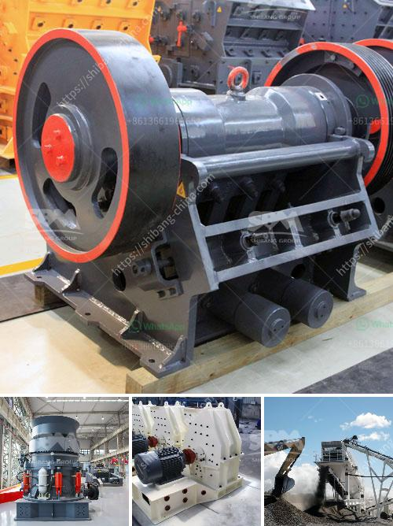

<h3>working principle of ball mill pdf</h3>
The ball mill is a type of grinding mill used for coarse grinding or fine grinding. This machine works on the principle of impact and attrition. It consists of a hollow cylinder filled with balls made of steel or other materials. The cylinder rotates around its axis, causing the balls to cascade and grind the material.

When the ball mill rotates, the balls move along the cylinder’s circumference and collide with the material being grinded. This impact produces mechanical pressure, resulting in the reduction of particle size. The material is then discharged through a screen or grated opening located at the end of the mill.

Another key principle of the ball mill is the continuous cascading of the grinding balls. This action ensures a thorough grinding of the material, maintaining a consistent particle size distribution. The rotation speed of the mill also plays a crucial role in achieving the desired fineness. Higher rotation speeds lead to more intense grinding and finer particles.

The design of the ball mill is such that there is a continuous flow of material through the mill, ensuring proper grinding and discharging. This continuous operation allows for high production rates, making the ball mill an essential equipment in many industries.

In conclusion, the ball mill is a versatile and efficient grinding machine designed to grind and blend materials for use in various industries. Its working principle involves impact and attrition, ensuring that grinding occurs with high intensity and efficiency.
<h3>Contact us</h3><ul><li><strong>Whatsapp:&nbsp;<a href="https://wa.me/8613661969651">+8613661969651</a></strong></li><li><a href="https://swt.shibang-china.com/?git&amp;zhl&amp;working principle of ball mill pdf"><strong>Online Service(chat now)</strong></a></li></ul><h3>Related</h3><ul><li><a href='vertical shaft impact crusher for sale.md'>vertical shaft impact crusher for sale</a></li><li><a href='operation crushing plant.md'>operation crushing plant</a></li><li><a href='dolomite roller mill.md'>dolomite roller mill</a></li><li><a href='stone crushers for sale south africa second hand.md'>stone crushers for sale south africa second hand</a></li><li><a href='screen mobile crusher.md'>screen mobile crusher</a></li></ul>