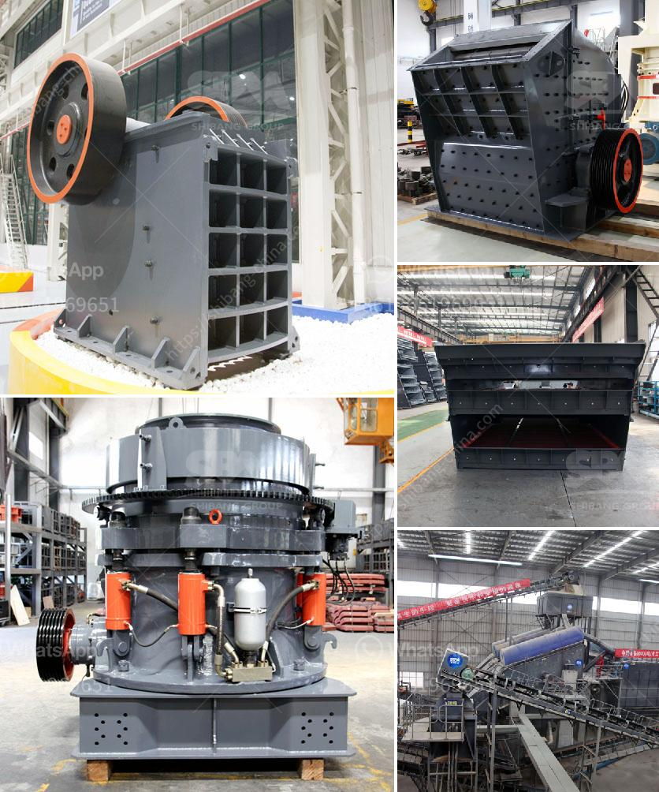

<h3>zhauns south africa price list pdf</h3>
South Africa is a land of opportunity for budding entrepreneurs. With a fast-growing economy and a thriving small business sector, many individuals are looking to start their own ventures and contribute to the country's economic development. However, establishing a successful business requires careful planning, access to resources, and the right equipment. This is where Zhauns comes in, a renowned supplier of various machinery and equipment for small and medium-sized enterprises. The Zhauns South Africa price list PDF is an indispensable tool for any entrepreneur looking to source the necessary equipment at competitive prices.

Zhauns is a well-established company that has been operating in South Africa for over four decades. It is known for providing a wide range of machinery, including brick and block making machines, food processing equipment, packaging machines, and printing machines, among others. Zhauns has built a solid reputation for its reliable products and exceptional customer service, making it an ideal partner for entrepreneurs across various industries.

One of the key advantages of accessing the Zhauns price list in PDF format is the convenience it offers. Entrepreneurs can easily browse through the comprehensive list of available equipment, sorted by categories, and compare prices to find the best fit for their business needs. They can access the price list at any time, making it easy to plan their investments and budget accordingly. Additionally, the PDF format allows for easy printing and sharing, enabling entrepreneurs to discuss their options with partners or stakeholders without any hassle.

The Zhauns South Africa price list PDF is also an invaluable resource for those seeking financing options. Many aspiring entrepreneurs may find it challenging to secure the necessary funds to purchase the required machinery outright. However, armed with the detailed price list, entrepreneurs can approach potential lenders or investors with concrete figures and estimates. The comprehensive breakdown of equipment costs, along with financing options provided by Zhauns, can aid entrepreneurs in presenting a solid business case, increasing their chances of securing funding.

Furthermore, the price list offers entrepreneurs the opportunity to explore different options and compare prices to make informed decisions. Starting a business involves managing costs effectively while ensuring the quality and reliability of the machinery. By carefully reviewing the price list, entrepreneurs can identify the most cost-effective options without compromising on the quality and performance of the equipment. This level of transparency empowers entrepreneurs to make strategic choices aligned with their business goals and financial constraints.

In conclusion, the Zhauns South Africa price list PDF is an invaluable resource for entrepreneurs embarking on their business journey. It provides convenience, transparency, and the necessary information to make informed decisions. With access to a wide range of equipment, entrepreneurs can find the perfect fit for their business needs while taking advantage of competitive pricing. Additionally, the price list aids in securing funding through its comprehensive breakdown of costs and financing options. With Zhauns as a trusted partner, aspiring entrepreneurs can confidently invest in the machinery needed to bring their entrepreneurial dreams to life.
<h3>Contact us</h3><ul><li><strong>Whatsapp:&nbsp;<a href="https://wa.me/8613661969651">+8613661969651</a></strong></li><li><a href="https://swt.shibang-china.com/?git&amp;zhl&amp;zhauns south africa price list pdf"><strong>Online Service(chat now)</strong></a></li></ul><h3>Related</h3><ul><li><a href='enquiry crushing machine.md'>enquiry crushing machine</a></li><li><a href='eagle 1400 crusher for sale.md'>eagle 1400 crusher for sale</a></li><li><a href='price stone crusher.md'>price stone crusher</a></li><li><a href='cs series cone crusher.md'>cs series cone crusher</a></li><li><a href='pebbel stone crusher.md'>pebbel stone crusher</a></li></ul>