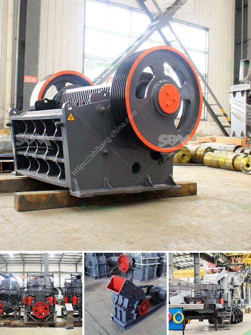

<h3>zimbabwe clay brick making machine</h3>
In the beautiful country of Zimbabwe, clay bricks have been an essential building material for centuries. These bricks are known for their durability, strength, and thermal insulation properties, making them perfect for constructing houses, schools, and other infrastructure. However, the traditional methods of brick making were labor-intensive and time-consuming, hampering the construction industry's progress.

But thanks to technological advancements, Zimbabwe now boasts state-of-the-art clay brick making machines that have revolutionized the construction industry. These machines have enabled builders to produce bricks faster, in larger quantities, and with increased precision. The introduction of these machines has led to a significant boost in the construction sector, stimulating economic growth and creating job opportunities for local communities.

The Zimbabwe clay brick making machine operates on innovative principles, combining the ancient technique of brick making with modern automation technology. This machine automates the entire process, from clay preparation to brick molding and drying. Its advanced features allow for higher production rates and consistent brick quality, ensuring uniformity in size and shape, which is essential for the stability of buildings.

One of the greatest advantages of the Zimbabwe clay brick making machine is its versatility. The machine can efficiently produce various types of bricks, including solid bricks, perforated bricks, and hollow bricks, catering to different construction requirements. This adaptability has further boosted its demand and popularity within the industry.

Moreover, the Zimbabwe clay brick making machine has proven to be environmentally friendly. It optimizes the use of raw materials, reducing wastage and minimizing negative environmental impacts. Additionally, the machine operates on electricity, making it a sustainable choice compared to traditional brick-making methods that rely on wood or fossil fuels.

The introduction of the clay brick making machine has not only transformed the construction landscape of Zimbabwe but also provided economic empowerment to many individuals. The availability of locally produced bricks at affordable prices has led to cost-effective construction options, making safe housing accessible to more people.

The Zimbabwe clay brick making machine has not only revolutionized the construction sector but also contributed to the overall development and progress of the country. With its efficiency, sustainability, and economic benefits, this innovative machine is set to shape the future of brick making in Zimbabwe and beyond.
<h3>Contact us</h3><ul><li><strong>Whatsapp:&nbsp;<a href="https://wa.me/8613661969651">+8613661969651</a></strong></li><li><a href="https://swt.shibang-china.com/?git&amp;zhl&amp;zimbabwe clay brick making machine"><strong>Online Service(chat now)</strong></a></li></ul><h3>Related</h3><ul><li><a href='high capacity stone hammer crusher.md'>high capacity stone hammer crusher</a></li><li><a href='basalt crushing plant.md'>basalt crushing plant</a></li><li><a href='packing plant in cement industry.md'>packing plant in cement industry</a></li><li><a href='dolomite stone crusher manufacturers.md'>dolomite stone crusher manufacturers</a></li><li><a href='big crushing machine.md'>big crushing machine</a></li></ul>